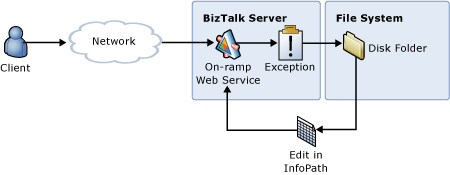

# Collecting Exceptions and Routing Messages for Repair and Resubmit
In this use case, a custom exception handler picks up a fault message received through a Web service and routes it to a disk file in a format compatible with an InfoPath template included with the [!INCLUDE[esbToolkit](../includes/esbtoolkit-md.md)]. The user can open the file using Microsoft InfoPath, edit the message contents, and resubmit the message for processing, as illustrated in Figure 1.  
  
   
  
 **Figure 1**  
  
 **Routing a message for repair and resubmission**  
  
 The Repair and Resubmit Custom Exception Handler sample included with the [!INCLUDE[esbToolkit](../includes/esbtoolkit-md.md)] demonstrates this use case. When a process in an orchestration encounters an error, the exception handler in that orchestration generates and publishes an ESB fault message. This fault message includes, in its payload, the messages (including their context properties that are related to BizTalk Server) that were "in flight" when the exception occurred, and the current exception caught by the BizTalk Orchestration engine. After an ESB fault message is published, it is de-queued to a subscribing orchestration (a custom exception handler) that extracts and inspects the in-flight messages and the system exception object, and routes the in-flight messages to a file folder, from which a user can edit the message using InfoPath and resubmit it to BizTalk Server for processing.  
  
 For more information, see [Running the Repair and Resubmit Custom Exception Handler Sample](../esb-toolkit/running-the-repair-and-resubmit-custom-exception-handler-sample.md).
