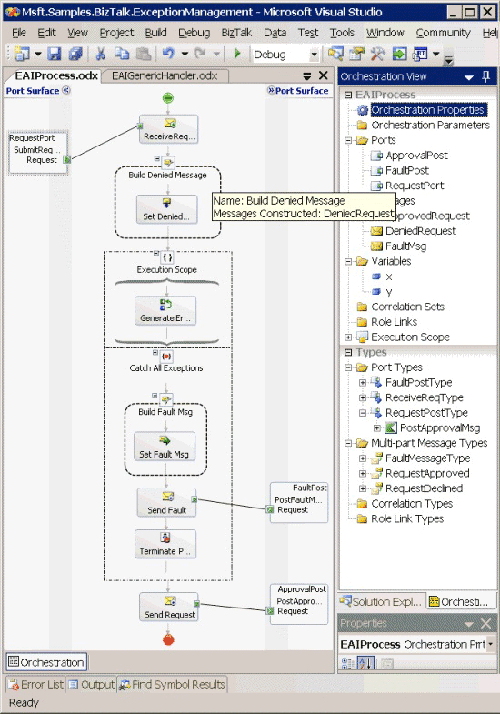
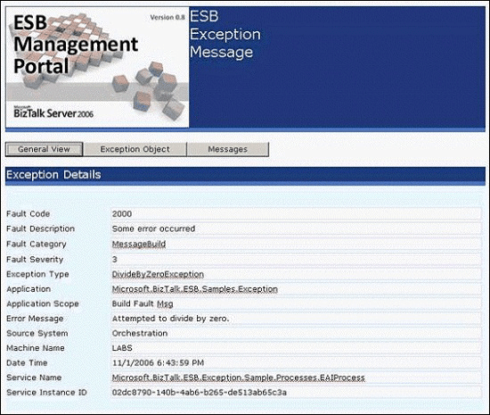

# Creating Custom Exception Handlers
For an application to detect and react to exceptions, developers must provide an exception handler. This exception handler can subscribe to a single type of exception message or to exception messages generated from some or all parts of a system or an application. For example, you may require only a single handler for all messages from a particular system (such as any exceptions occurring in the payroll system), or you may instead require targeted handlers for specific failures (such as detecting if the check print process fails).  
  
 To subscribe to a specific type of exception, use an orchestration that has a filter on the activating Receive shape, as shown in the following example.  
  
```csharp  
Microsoft.Practices.ESB.ExceptionHandling.Schemas.Property.FaultCode == "1000";  
```  
  
 You may also have a filter condition on a send port that sends a message to the file system or via e-mail if the message meets a specific filter condition.  
  
## Sample Exception Handling Projects  
 The [!INCLUDE[esbToolkit](../includes/esbtoolkit-md.md)] includes several sample BizTalk applications that demonstrate exception handling. These samples can be found in the \Source\Samples\Exception Handling folder.  
  
 There are also four BizTalk projects, located in the GlobalBank.ESB.Samples.ExceptionHandling solution, that demonstrate how to use the ESB Failed Orchestration Exception Routing mechanism. These projects are preconfigured to deploy into the GlobalBank.ESB BizTalk application. The projects are the following:  
  
- **ESB.ExceptionHandling.Schemas.** This project contains the schemas used for the sample orchestrations.  
  
- **ESB.ExceptionHandling.Pipelines.** This project contains the send pipeline configured with the exception processor, used in a send port that subscribes to all exceptions. This includes exceptions generated by BizTalk and exceptions generated by the Exception Management Framework.  
  
- **ESB.ExceptionHandling.Processes.** This project contains the EAIProcess.odx orchestration, which simulates an exception by attempting to divide by zero and calls the **CreateFaultMessage** and **AddMessage** methods to generate a suitable fault message, as shown in Figure 1.  
  
     
  
   **Figure 1**  
  
  **The EAIProcess.odx orchestration in the Processes sample project**  
  
- **ESB.ExceptionHandling.Handlers.** This project contains the EAIGenericHandler.odx orchestration, which calls the **GetMessages** method and iterates through the **MessageCollection** using the **MoveNext** method, as shown in Figure 2.  
  
    
  
  **Figure 2**  
  
  **The EAIGenericHandler.odx orchestration in the Handlers sample project**  
  
  The ESB.ExceptionHandling.Handlers project also contains the EAIProcessHandler.odx orchestration, which calls the **GetMessage** and **GetException** methods, as shown in Figure 3.  
  
    
  
  **Figure 3**  
  
  **The EAIProcessHandler.odx orchestration in the Handlers sample project**