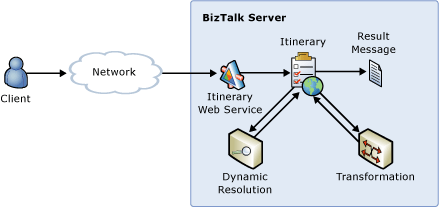

# Defining Routing and Message Transformation Service Invocations Using Itineraries
In this use case, a message submitted for processing contains an itinerary SOAP header that describes the list of services to execute and their resolution requirements. Specifically, a transformation and routing service are defined, each optionally requiring resolution through a Universal Description, Discovery, and Integration (UDDI), Business Rules Engine Policy, XML Path Language (XPath), or STATIC lookup. This use case can be extended by adding other services to the itinerary at the time of message publication.  
  
 The [!INCLUDE[esbToolkit](../includes/esbtoolkit-md.md)] provides two types of itinerary on-ramps: those that support one-way communication and those that support request-response scenarios. Because the dynamic resolution mechanism can use information in the itinerary to look up endpoints or bind dynamically to endpoints, there is no requirement for Microsoft BizTalk Server to contain specific endpoint routing details. Figure 1 illustrates a schematic view of the process.  
  
   
  
 **Figure 1**  
  
 **Defining routing and message transformation service invocations using itineraries**  
  
 The Itinerary On-Ramp sample included with the [!INCLUDE[esbToolkit](../includes/esbtoolkit-md.md)] demonstrates this use case. It shows how to create itineraries that contain resolution, routing, and service invocation instructions as a series of itinerary steps that define how the [!INCLUDE[esbToolkit](../includes/esbtoolkit-md.md)] and BizTalk Server will process the message using the publish-subscribe functionality of BizTalk Server. One-way and request-response samples are included.  
  
 For more information, see [Installing and Running the Itinerary On-Ramp Sample](../esb-toolkit/installing-and-running-the-itinerary-on-ramp-sample.md).
