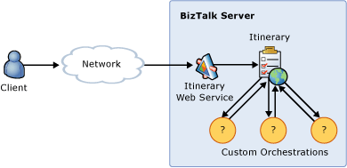

# Defining Custom Orchestration Service Execution Using Itineraries
In this use case, a message submitted for processing contains an itinerary SOAP header that describes the list of services to execute and their resolution requirements. The itinerary specifies one or more custom orchestrations or processes through which the message will pass during the processing cycle. Custom orchestrations have full control of the itinerary and other custom properties exposed in the message context. Optionally, the itinerary can contain dynamic resolution information that determines transformation requirements and endpoints for the message. Figure 1 illustrates a schematic view of the process.  
  
   
  
 **Figure 1**  
  
 **Defining custom orchestration service execution using itineraries**  
  
 The Itinerary On-Ramp sample included with the [!INCLUDE[esbToolkit](../includes/esbtoolkit-md.md)] demonstrates this use case. It shows how to create itineraries that contain resolution, routing, and service invocation instructions as a series of itinerary steps that define how the ESB and [!INCLUDE[prague](../includes/prague-md.md)] will process the input message. One-way and request-response samples are included.  
  
 For more information, see [Installing and Running the Itinerary On-Ramp Sample](../esb-toolkit/installing-and-running-the-itinerary-on-ramp-sample.md).