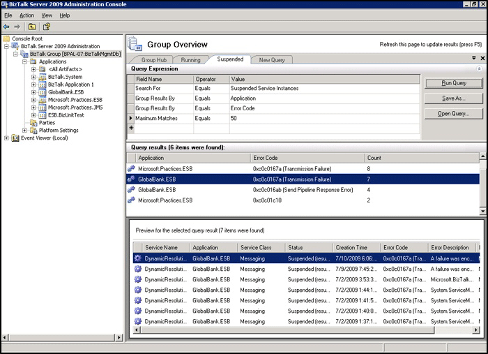

# Design of the ESB Exception Management Framework
Consistent and re-usable patterns for managing exceptions are a core consideration of any development project; they help to maximize maintainability and make it easier to support the application after deployment.  
  
 A typical BizTalk application might use the BizTalk messaging features, optionally start processing an orchestration, call the Business Rule Engine, interact with several line-of-business (LOB) or enterprise resource planning (ERP) systems, and return a response to a separate third-party system. In addition, the run-time location of these components, including the BizTalk subsystems, may reside on one or more servers distributed throughout the current environment. This is a typical scenario and requires the system to support catching and reporting exceptions that may occur in any of the ESB or BizTalk decoupled subsystems or in the various third-party LOB systems, each of which has its own exception handling constraints. For example, the mainframe may reject an order sent from a Web site during a normal processing cycle; the Web site must compensate for this error and notify the user.  
  
 Because of the complexity of ESB applications and their environment, development of a consistent solution for application exception management should embody the following common design goals:  
  
- Provide a standardized approach for detecting and handling exceptions that occur in the BizTalk Server environment (that is, in the messaging and orchestration subsystems).  
  
- Provide common patterns that allow automated processes to react to and manage application exceptions.  
  
- Provide a loosely coupled exception management pattern that facilitates reuse.  
  
- Provide a common reporting mechanism for application exceptions and their available message states that can apply to any BizTalk subsystem.  
  
  To understand why the [!INCLUDE[esbToolkit](../includes/esbtoolkit-md.md)] provides a custom error mechanism, namely the Exception Management Framework, and how it works, it is necessary to understand the exception management features available in BizTalk Server and why these features are not fully capable of meeting the preceding design goals.  
  
## BizTalk Server Exception Reporting  
 BizTalk Server supports the following exception handling and reporting mechanisms:  
  
- Failed Message Routing  
  
- BizTalk Server Administration Console  
  
- Microsoft Event Log  
  
- Custom development options  
  
  By default, BizTalk Server's capabilities for handling exceptions rely a great deal on operator intervention. For example, consider the situation where a user submits a message to BizTalk Server that causes an exception during the validation stage. By default, the message is published to the Message Box database, where it is routed to a suspended queue. This means that an operator must do the following:  
  
- Independently detect that an exception occurred.  
  
- Manually save the failed message to disk using the BizTalk Server Administration Console.  
  
- Manually edit and correct the message and re-submit it to the system. In some instances, this process has the potential for losing important context information.  
  
  To resolve these issues, BizTalk Server provides the Failed Message Routing mechanism. Developers and administrators can use this to create orchestration processes or messaging send ports configured to subscribe to any exceptions that occur in the messaging subsystem. This provides an automated error-detection and routing mechanism that preserves the original message state and solves the problem of detecting exceptions.  
  
  Because automatic failed message routing is not provided for orchestration processes, the developer must account for errors by adding exception handler blocks to orchestration scope shapes. With this solution, each orchestration can have its own exception handling, but there is no mechanism for reusing exception handling functionality across multiple orchestrations.  
  
  This means that there are now two very different ways in which messaging exceptions are processed and managed in a BizTalk Server system, and a third way in which orchestration exceptions are processed. Therefore, developers must customize the exception handling mechanism to suit their own requirements if they want to implement a system that matches the requirements described earlier in this section.  
  
## BizTalk Server Administration Console  
 The BizTalk Server Administration Console provides a set of Group Overview pages, referred to as the BizTalk Group Hub. Using these pages, administrators can query for suspended messages and exceptions grouped by application, service name, error code, or URI, as shown in Figure 1.  
  
   
  
 **Figure 1**  
  
 **The BizTalk Server Administration Console Group Overview pages**  
  
 Although the Group Overview feature provides a common user interface to view exceptions, the views are limited to "live" service instances. Examining the state can be a cumbersome task because administrators must drill down through the tree to each item. In addition, several other factors limit the BizTalk Server Administration Console capabilities as an application exception-reporting tool:  
  
- There is no capability for mining the data for business intelligence. For example, you cannot query for the worst offending applications on a monthly basis or examine quarterly trends for application exceptions.  
  
- The business may require alerts to be raised when certain application exceptions occur or when reaching specific thresholds, but there is no facility to subscribe to these types of exception events.  
  
- The Microsoft Management Console (MMC) that the Administration Console uses as its user interface (UI) mechanism is not an ideal interface, and it is not always convenient to access in production environments. At minimum, it requires users to be members of the BizTalk Operators role; and, in production environments, access to the MMC is usually only possible through Terminal Server.  
  
- The console displays only unhandled exceptions (suspended service instances). If the developer handles the exception in the orchestration, allowing the orchestration to complete normally, the exception information will never appear in the Administration Console.  
  
  The [!INCLUDE[esbToolkit](../includes/esbtoolkit-md.md)] addresses these limitations through the ESB Failed Orchestration Exception Routing mechanism. This closely resembles the Failed Message Routing mechanism of BizTalk Server. In addition, the [!INCLUDE[esbToolkit](../includes/esbtoolkit-md.md)] includes a pipeline component in a send port that subscribes to messages generated from both the ESB Failed Orchestration Exception Routing mechanism and the Failed Message Routing mechanism and normalizes them.  
  
  The ESB Exception Management Framework takes advantage of other features in BizTalk Server, such as the subscription model, and event-based Business Activity Monitoring (BAM). This means that the ESB Exception Management Framework can track the exception data points with BAM, and then publish them to the BizTalk BAM Portal for monitoring.