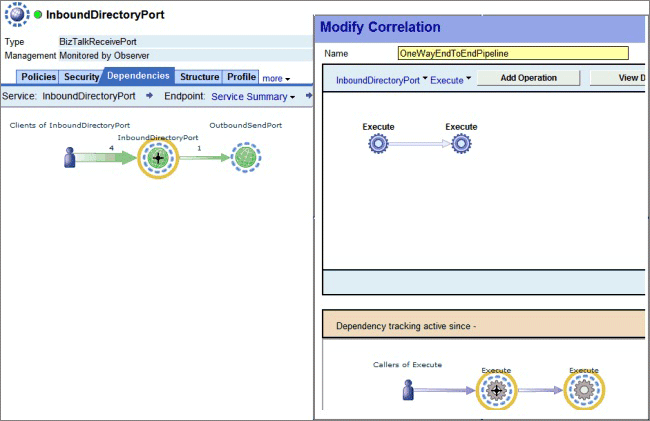
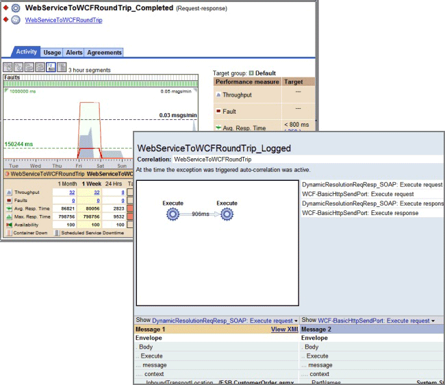

# End-to-End Transaction Tracking
Business visibility relates to the ability of operators and users to monitor the flow of traffic through the run-time environment. Enterprises must be able to track the processes and transactions flowing through their systems at each step to ensure that they play their part in contributing to revenue generation. AmberPoint SMS simplifies the measurement and tracking of these messages in Microsoft BizTalk Server. The system allows users to define new units of management that align with end-to-end business process flows, instead of being required to conform to the way developers chose to package and deploy individual service components. Figure 1 shows the screen for defining management units.  
  
   
  
 **Figure 1**  
  
 **Defining a transaction as a new unit of management**  
  
 After defining transactions, users can instrument and track messages associated with each transaction using the same tools that provide visibility into a single service. These tools can expose performance metrics, monitor performance against service level agreements, and generate message logs, as shown in Figure 2.  
  
   
  
 **Figure 2**  
  
 **Monitoring the end-to-end performance of a pipeline**  
  
 A major requirement for successful run-time governance and system monitoring is the detection of important business events, such as exceptions and application errors that may disrupt the logical processing of business transaction flows. AmberPoint SMS allows operators and users to gain insight into operational and business events and to monitor the impact these events have on all components that depend on the service that generated the problem. In addition, operators and users can quickly troubleshoot the entire system to identify the root-cause of a problem.