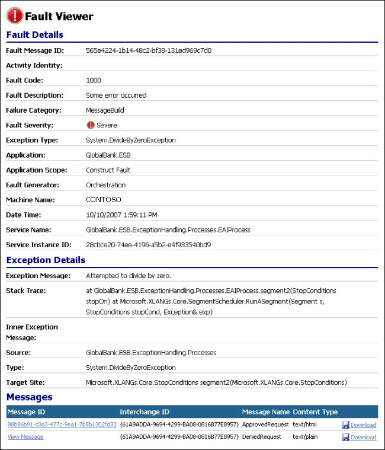

# Fault Details View
Figure 1 shows Fault Details view, which displays the ambient properties of the fault and the underlying exception. At the bottom of this page is a list of messages associated with this fault. Click the identifier of one of these messages to open it in [Message Details View](../esb-toolkit/message-details-view.md), or click the **Download** icon at the end of the row to download the message as an XML document.  
  
   
  
 **Figure 1**  
  
 **The ESB Fault Message Viewer showing the Fault Details view**