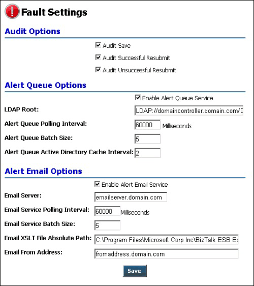

# Fault Settings Page
Figure 1 shows the Fault Settings page. This page displays a range of administrative settings that you can modify.  
  
   
  
 **Figure 1**  
  
 **The ESB Management Portal Fault Settings page**  
  
 The following list explains how you can use the features of the ESB Management Portal Fault Settings page:  
  
-   To change the audit options, select the check boxes for each event you want to audit. The available events are the saving of modified settings, successful resubmission of a fault after editing, and failure when resubmitting a fault.  
  
-   The portal maintains a queue of the alerts generated by the Portal Alert service. You can modify the settings for this service in the **Alert Queue Options** section of the page. You can enable or disable the service, specify its interaction with Microsoft Active Directory directory service, and control the queue batch size and polling interval.  
  
-   To change the settings for the Alert Email service, use the controls in the **Alert Email Options** section of the page. You can enable or disable the service; specify the e-mail server and the "from" address; change the polling interval and batch size; and specify the path to XSLT files that the service uses.  
  
> [!NOTE]
>  You must enter the values in this page when you install and configure the ESB Portal and the Portal Alert service. For more information, see [Installing the ESB Management Portal](http://go.microsoft.com/fwlink/?LinkId=188554).