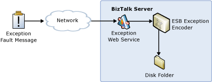

# Handling Externally Submitted Exceptions Using a Custom Handler
In this use case, an external client submits an exception message through a Web service. A send port, preconfigured with the ESB Exception Encoder pipeline component, subscribes to the fault message; it processes and persists it as a disk file that you can view using Microsoft InfoPath, as shown in Figure 1.  
  
   
  
 **Figure 1**  
  
 **Handling incoming exception or fault messages and persisting to a disk file**  
  
 The Exception Handling Service Sample included with the [!INCLUDE[esbToolkit](../includes/esbtoolkit-md.md)] demonstrates this use case. It shows how to use the ESB Exception Service as a universal mechanism to submit fault messages from external applications that will be stored in the [!INCLUDE[esbToolkit](../includes/esbtoolkit-md.md)] exception management database. For more information, see [Running the Exception Handling Service Sample](../esb-toolkit/running-the-exception-handling-service-sample.md).