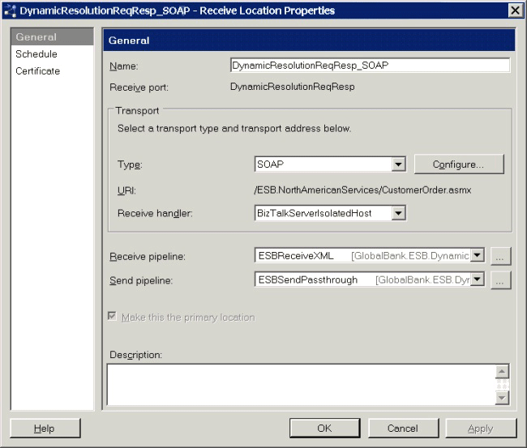
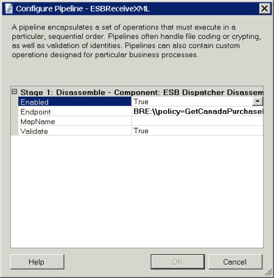

# How the Dynamic Resolution Sample Works
The Dynamic Resolution sample uses the ESB Dispatcher Disassembler pipeline component for all the messaging examples described in the previous section.  

 For one-way messaging scenarios, the example resolves the endpoint using the STATIC, BRE, or XPATH Resolver and brokers the protocol from FILE to FILE, FTP, or MQSeries.  

 For two-way messaging scenarios, the example resolves the endpoint using the STATIC, BRE, UDDI, or XPATH Resolver and brokers the protocol from SOAP to either SOAP or WCF-BasicHttp. In addition, the examples resolve and execute Microsoft BizTalk maps using the BRE Resolver, which uses facts contained in the message context properties and the message body to determine the resolution result.  

 The result of the resolution process is that all the two-way examples submit their message to the ESB.CanadianServices Web service located at http://localhost/ESB.CanadianServices/SubmitPOService.asmx. In addition, depending on the resolution result, the example executes either the **submitOrder** or the **submitPurchase** action. Additionally, the ESB Dispatcher Disassembler pipeline component dynamically executes a BizTalk map, depending on the specified or the resolved action.  

 Figure 1 shows the configured pipelines for the DynamicResolutionReqResp_SOAP receive location.  

   

 **Figure 1**  

 **The configured pipelines of the DynamicResolutionReqResp_SOAP receive location of the Dynamic Resolution sample application**  

 Figure 2 shows the per-instance properties of the ESBReceiveXML component that uses the ESB Dispatcher Disassembler.  

   

 **Figure 2**  

 **The per-instance properties for the components in the ESBReceiveXML pipeline of the Dynamic Resolution sample application**  

 The following properties are shown in Figure 2:  

- **Enabled**. This property determines whether the pipeline is active. If this is set to **False**, messages pass through without processing.  

- **Endpoint**. This property is the connection string used to determine which resolver to load, and it specifies the endpoint configuration.  

- **MapName**. This property is the connection string used to determine which resolver to load and which BizTalk map to execute. It can be the fully qualified name of a map instead of a resolver connection string.  

- **Validate**. When set to **True** (the default setting), the ESB Dispatcher Disassembler component instructs the ESB Transformation service to validate the source message against the source schema defined in the map that is will resolve and execute.  

  Figure 3 shows the per-instance properties of the ESBSendPassthrough component that uses the ESB Dispatcher.  

    

  **Figure 3**  

  **The per-instance properties for the components in the ESBSendPassthrough pipeline of the Dynamic Resolution sample application**  

  The following properties are shown in Figure 3:  

- **Enabled**. This property determines whether the pipeline is active. If this is set to **False**, messages pass through without processing.  

- **Endpoint**. This property is the connection string used to determine which resolver to load and the end-point configuration.  

- **MapName**. This property is the connection string used to determine which resolver to load and which BizTalk map to execute. A fully qualified name of a map can be used in place of a resolver's connection string.  

- **Validate**. When set to **True** (the default setting), the ESB Dispatcher Disassembler component instructs the ESB Transformation service to validate the source message against the source schema defined in the map that is will resolve and execute.
