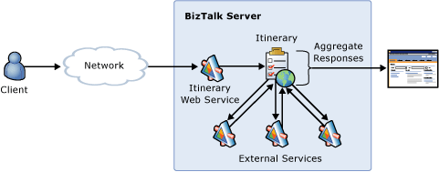

# Implementing the Scatter-Gather Pattern for Multiple Web Service Invocations
In this use case, a message contains an itinerary service step that specifies more than one external service that BizTalk Server should access. It uses dynamic resolution to determine service locations and endpoints and any optional BizTalk Service maps for transforming the returned data. The orchestration implementing this service performs the transformation and invocations, and all service invocations occur asynchronously. After all service invocations complete, the itinerary service aggregates the responses into a single response message and sends the message to the client through a dynamically assigned endpoint. Figure 1 illustrates this use case.  
  
   
  
 **Figure 1**  
  
 **Implementing the Scatter-Gather pattern for multiple Web service invocations**  
  
 The Scatter-Gather sample included with the [!INCLUDE[esbToolkit](../includes/esbtoolkit-md.md)] demonstrates this use case.  
  
 For more information, see [Installing and Running the Scatter-Gather Sample](../esb-toolkit/installing-and-running-the-scatter-gather-sample.md).
