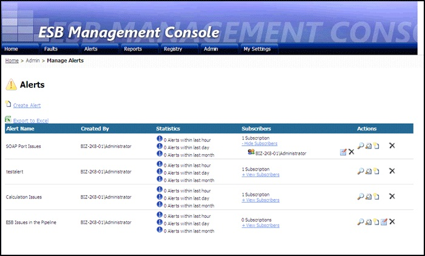

# Manage Alerts (Administration View)
Figure 1 shows the Alerts page in administration view, which administrators can use to view a list of all alerts and a summary of their activity. A table displays a row for each alert. Each row shows the alert name, the name of the creator, general statistics for the alert (such as number of alert activations within the last hour, day, or month), a count of subscribers for the alerts with a link to view a list, and an Actions column containing a set of clickable icons to perform actions on the alert.  
  
   
  
 **Figure 1**  
  
 **The ESB Management Portal Manage Alerts (Administration view) page**  
  
 The following list explains how you can use the features of the ESB Management Portal Manage Alerts page:  
  
-   Click the **Create Alert** link at the top of the page to create a new alert.  
  
-   Click the **Export To Excel** link to export the list of alerts as a Microsoft Excel spreadsheet.  
  
-   Click the + **View Subscribers** link in a row to show a list of subscribers for the alert. The list expands within the row, and a delete icon appears in the Actions column for each one that allows administrators to remove a subscriber from the alert. At the same time, the link changes to - **Hide Subscribers**, allowing you to collapse the list of subscribers.  
  
-   Click an icon in the Actions column to perform a task for the alerts in that row. The icons (in the order they appear) and the tasks are the following:  
  
    -   **View alert details.** This icon displays details of the selected alert.  
  
    -   **View history**. This icon displays a table containing all the activations for the selected alert.  
  
    -   **Add subscriber**. This icon allows administrators to add a subscriber to the selected alert.  
  
    -   **Edit alert**. This link allows administrators to edit the alert details.  
  
    -   **Delete alert**. This link deletes the alert and all associated subscriptions.
