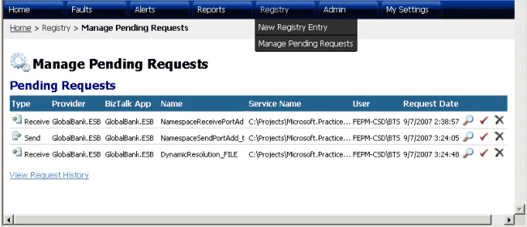

# Manage Pending Requests Page
Figure 1 shows the Manage Pending Requests page, which shows a list of pending registration requests and provides a link to view the request history.  
  
   
  
 **Figure 1**  
  
 **The ESB Management Portal Manage Pending Requests page**  
  
 The following list explains how you can use the features of the ESB Management Portal Manage Pending Requests page:  
  
-   Click the **ViewDetails** icon (the magnifying glass) to open the [Registry Details Page](../esb-toolkit/registry-details-page.md), where you can view details of the pending request, publish it, update it, or delete it.  
  
-   Click the **Approve** icon (the check mark) to approve the pending request.  
  
-   Click the **Reject** icon (the cross mark) to reject the pending request.  
  
-   Click the **View Request History** link to open a page that displays a range of information for previous Universal Description, Discovery, and Integration (UDDI) registration requests.
