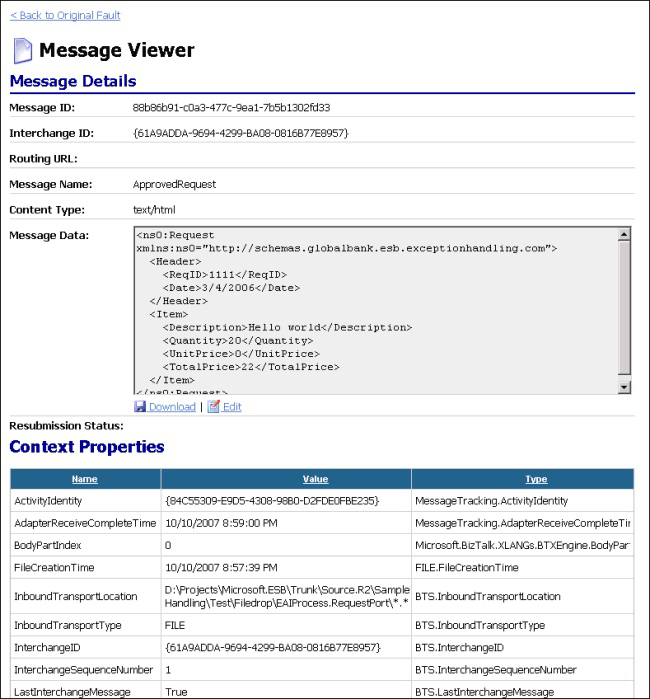

# Message Details View
Figure 1 shows the Message Details view, which displays the ambient properties of the message you selected in the Fault Details view, the message content, and the values of the context properties of the persisted message. Click the **Download** icon above the message data to download it as an XML document. Click the **Edit** icon below the message data to edit and resubmit the message.  
  
   
  
 **Figure 1**  
  
 **The ESB Fault Message Viewer showing the Message Details view**