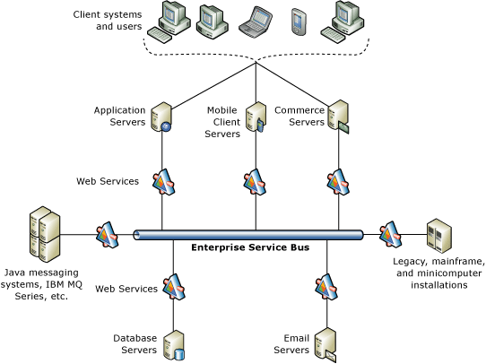
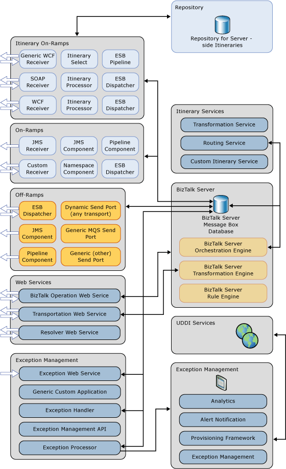

# Microsoft BizTalk ESB Toolkit
  
  
## Summary  
 The [!INCLUDE[esbToolkit](../includes/esbtoolkit-md.md)] uses [!INCLUDE[btsBizTalkServerNoVersion_md](../includes/btsbiztalkservernoversion-md.md)] to support a loosely coupled messaging architecture. BizTalk Server includes a powerful publish/subscribe mechanism for messaging applications that works by creating and filling subscriptions, which provides a highly efficient and scalable platform for service-oriented architecture (SOA) applications.  
  
 The [!INCLUDE[esbToolkit](../includes/esbtoolkit-md.md)] extends the functionality of BizTalk Server to provide a range of new capabilities focused on building robust, connected, service-oriented applications that incorporate itinerary-based service invocation for lightweight service composition, dynamic resolution of endpoints and maps, Web service and WS-* integration, fault management and reporting, and integration with third-party SOA governance solutions.  
  
## Overview  
 The [!INCLUDE[esbToolkit](../includes/esbtoolkit-md.md)] provides architectural guidance, patterns, and a collection of BizTalk Server and .NET Framework components to simplify the development of an Enterprise Service Bus (ESB) on the Microsoft platform and to allow Microsoft customers to extend their own messaging and integration solutions.  
  
## Common Scenarios  
 The term Enterprise Service Bus (ESB) is widely used in the context of implementing an infrastructure for enabling a service-oriented architecture (SOA). However, real-world experience with the deployment of SOAs has shown that an ESB is only one of many building blocks that make up a comprehensive Service-Oriented Infrastructure (SOI). The term ESB has morphed in a number of different directions, and its definition depends on the interpretation of individual ESB and integration platform vendors and on the requirements of particular SOA initiatives.  
  
 Based on the experience Microsoft has gathered from many successful real-world SOI implementations, you can think of an ESB as a collection of architectural patterns based on traditional enterprise application integration (EAI), message-oriented middleware, Web services, .NET and Java interoperability, host system integration, and interoperability with service registries and asset repositories.  
  
 Figure 1 shows a high-level view of the type of interconnectivity that an ESB architecture can provide.  
  
   
  
 **Figure 1**  
  
 **A high-level example of the connectivity provided the Enterprise Service Bus architecture**  
  
## Audience Requirements  
 The [!INCLUDE[esbToolkit](../includes/esbtoolkit-md.md)] is intended for developers who create Microsoft BizTalk Server solutions or other solutions that use the [!INCLUDE[esbToolkit](../includes/esbtoolkit-md.md)] components. To take full advantage of the [!INCLUDE[esbToolkit](../includes/esbtoolkit-md.md)], developers should possess knowledge and experience working with the following:  

- [!INCLUDE[btsBizTalkServerNoVersion_md](../includes/btsbiztalkservernoversion-md.md)]

- [!INCLUDE[btsVStudioNoVersion_md](../includes/btsvstudionoversion-md.md)]
  
- Microsoft .NET development techniques, including the development of ASP.NET Web services and .NET Framework components  
  
## Design Goals  
 The [!INCLUDE[esbToolkit](../includes/esbtoolkit-md.md)] consists of a series of interoperating components that support and implement a loosely coupled messaging environment that makes it easier to build message-based enterprise applications. The services and components fall naturally into the following seven categories:  
  
- **Web services** : These expose internal services such as itinerary processing, exception management, resolution of endpoints and maps, BizTalk Server operations, and message transformation.  
  
- **Itinerary services** : These include orchestration-based and messaging-based services for performing itinerary-based routing for [!INCLUDE[btsBizTalkServerNoVersion_md](../includes/btsbiztalkservernoversion-md.md)]. You can create custom services for itinerary-based routing.  
  
- **Itinerary on-ramps.** These receive external messages, attach the appropriate itinerary for each message, and perform itinerary processing; they use the [!INCLUDE[esbToolkit](../includes/esbtoolkit-md.md)] Resolver and Adapter Provider Framework for dynamic resolution of endpoints and metadata.  
  
- **On-ramps** : These receive external messages in a range of formats and transports, such as HTTP, JMS, WMQ, FTP, Flat File, and XML. They are typical BizTalk Server receive locations that optionally use the [!INCLUDE[esbToolkit](../includes/esbtoolkit-md.md)] interop pipeline components and the [!INCLUDE[esbToolkit](../includes/esbtoolkit-md.md)] Resolver and Adapter Provider Framework for dynamic resolution of endpoints and metadata.  
  
- **Off-ramps** : These implement send ports for the delivery of messages using formats and transports such as SOAP, WCF, JMS, WMQ, FTP, HTTP, Flat File, XML, or any other custom formats. They are typical BizTalk Server dynamic send ports that are direct-bound to the Message Box and that optionally use the [!INCLUDE[esbToolkit](../includes/esbtoolkit-md.md)] interop pipeline components and the [!INCLUDE[esbToolkit](../includes/esbtoolkit-md.md)] Resolver and Adapter Provider Framework for dynamic resolution of endpoints and metadata.  
  
- **Exception Management Framework** : This includes the exception Web service, the exception management API, and components that enrich, process, and pass exception details to the ESB Management Portal.  
  
- **ESB Management Portal** : This provides registry provisioning, exception mediation, alert notification, and analytics.  
  
  Many of these components and services rely on features implemented by [!INCLUDE[btsBizTalkServerNoVersion_md](../includes/btsbiztalkservernoversion-md.md)], such as the Orchestration, Transformation, and Business Rules engines and the Message Box database. Figure 2 shows a schematic view of the categories; the components and services typically occurring within each category; and the core BizTalk Server system components used by the [!INCLUDE[esbToolkit](../includes/esbtoolkit-md.md)].  
  
    
  
  **Figure 2**  
  
  **The architecture and components of the [!INCLUDE[esbToolkit](../includes/esbtoolkit-md.md)]**  
  
## How the BizTalk ESB Toolkit Works  
 The [!INCLUDE[esbToolkit](../includes/esbtoolkit-md.md)] accepts inbound messages and operates on them, perhaps (but not always) by performing processes such as transformation, delivery, or any other custom defined process. To specify the operations required, the core processing components require a message to contain associated instructions or metadata that define the processes to apply and the tasks to execute with the message content.  
  
 This approach provides loose coupling between services; this means that the ESB does not require prior knowledge of the specific processing for each message. It just has to know the possible range of processes and how to apply each process. The wide range of options for specifying the available processes and the mapping between the processes and the instructions within messages provides a flexible mechanism for configuring and adjusting behavior, without requiring changes to code and redeployment of components.  
  
## In this section

- [Install and configure the Microsoft BizTalk ESB Toolkit](install-and-configure-the-microsoft-biztalk-esb-toolkit.md)

- [Introduction to the BizTalk ESB Toolkit](introduction-to-the-biztalk-esb-toolkit.md)

- [Getting started and understanding the BizTalk ESB Toolkit](getting-started-with-the-biztalk-esb-toolkit.md)

- [Key scenarios and development tasks](key-scenarios-and-development-tasks.md)

- [Creating itineraries using itinerary designer](creating-itineraries-using-itinerary-designer.md)

- [BizTalk ESB Toolkit sample applications](biztalk-esb-toolkit-sample-applications.md)

- [Modifying and extending the BizTalk ESB Toolkit](modifying-and-extending-the-biztalk-esb-toolkit.md)

- [Administration with the BizTalk ESB Toolkit](administration-with-the-biztalk-esb-toolkit.md)

- [SOA governance integration](soa-governance-integration.md)

- [Troubleshooting the BizTalk ESB Toolkit](troubleshooting-the-biztalk-esb-toolkit.md)
  
## Related topics  
  
-   [BizTalk Service Oriented Solutions](../core/service-oriented-solution.md)

- [Using Web Services with BizTalk Server](../core/using-web-services.md)  