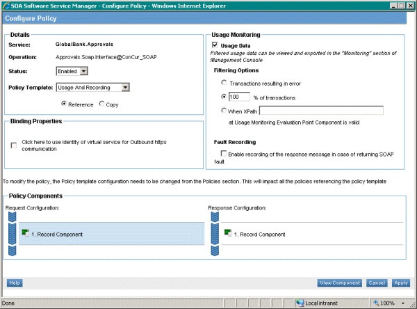
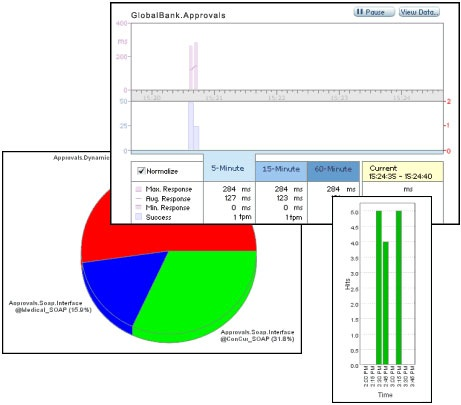
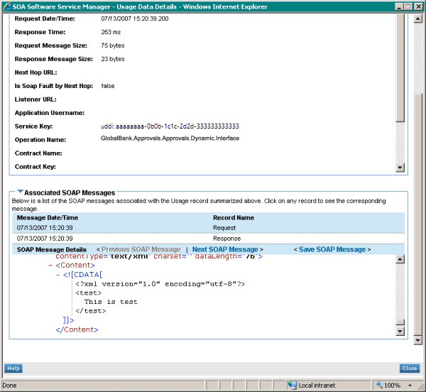

# Monitoring Policies and Usage Information
The SOA Service Manager provides a mechanism that allows you to create and edit monitoring policies. For example, Figure 1 shows the screen for applying a policy template and activating monitoring for an application.  
  
   
  
 **Figure 1**  
  
 **The SOA Service Manager showing the monitoring features available on the Workbench page**  
  
 The SOA Service Manager also provides usage information for applications, services, and individual send ports and receive locations. This information includes charts that display the relative usage of each operation and usage over time, service usage, and response time information. Figure 2 shows some examples.  
  
   
  
 **Figure 2**  
  
 **A selection of the charts that the SOA Service Manager can generate to assist in monitoring server and application behavior and performance**  
  
 In addition, SOA Service Manager includes features that allow you to view details of individual messages, including the size, response time, operation name, and the associated SOAP messages, as shown in Figure 3.  
  
   
  
 **Figure 3**  
  
 **The SOA Service Manager showing details of an individual message**  
  
> [!NOTE]
>  SOA Service Manager and Workbench products are products from SOA Software, Inc. that integrate with [!INCLUDE[prague](../includes/prague-md.md)]. For more information about SOA Software and their products, and to download the latest installation and operational instructions, see the [SOA Software](http://go.microsoft.com/fwlink/?LinkId=188559) Web site.