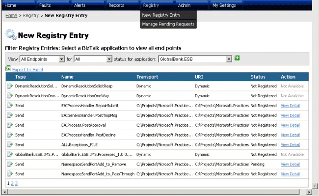

# New Registry Entry Page
Figure 1 shows the ESB Management Portal New Registry Entry page where you can view a list of the existing endpoints in a specified Microsoft BizTalk Server ESB application.  
  
   
  
 **Figure 1**  
  
 **The ESB Management Portal New Registry Entry page**  
  
 The following list explains how you can use the features of the ESB Management Portal New Registry Entry page:  
  
-   Use the three drop-down lists near the top of the page to specify the type, status, and BizTalk application that contains the endpoints you want to view:  
  
    -   In the first (endpoint type) drop-down list, you can select **Receive Locations, Send Ports,** or **All Endpoints**.  
  
    -   In the second (status) drop-down list, you can select **Registered, NotRegistered, Pending,** or **All**.  
  
    -   In the third (BizTalk application) drop-down list, you can select one of the currently installed BizTalk applications.  
  
-   After specifying the application and endpoint criteria, click the arrow icon next to the BizTalk application drop-down list to display a list of matching endpoints.  
  
-   The list of endpoints contains details of matching endpoints. For each one that is not a dynamic endpoint, the list contains a link that allows you to view and edit the details of a pending request to publish this endpoint.  
  
-   Click the **View Detail** link in any row of the list to open the [Registry Details Page](../esb-toolkit/registry-details-page.md) where you can modify the request and publish the endpoint.