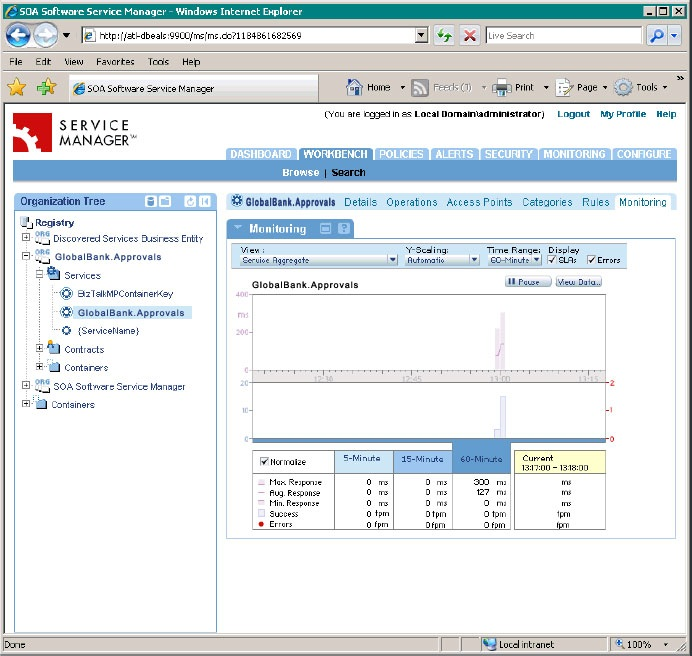

# Overview of the SOA BizTalk Management Point
The BizTalk Management Point natively integrates with SOA Service Manager and Workbench products. Unlike the typical Web Services Management Point, this implementation is associated with services provided by the Microsoft BizTalk Server environment, expressed in terms of BizTalk Server receive locations and send ports. Because of the arbitrary nature of receive locations and send ports (configured against a variety of BizTalk Server adapters), these services are not necessarily associated with Web services, but they can be treated as Web services in terms of the SOA Service Manager and SOA Workbench.  
  
 Figure 1 shows the SOA Service Manager Web application displaying the Workbench page for an example application. The left-side tree view allows users to navigate through the applications and services installed within BizTalk Server, and the right-side pane allows users to view application details, operations, access ports, categories, rules, and monitoring information.  
  
   
  
 **Figure 1**  
  
 **The SOA Service Manager showing the monitoring features available on the Workbench page**  
  
 You can monitor all the operations within an application (all send ports and receive locations), or specific operations; the Workbench shows a list of the messages passing through the selected send ports and receive locations. When you double-click a message in the list, the Workbench displays details of the message, and its context properties (if recording is enabled). Alternatively, you can select a specific service and monitor in real-time messages passing through that service.
