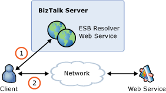

# Point-to-Point Resolution of Endpoints and Transformation Requirements
In this use case, a Web service client calls a Web service without going through the ESB. The two points communicate directly, but before the client makes the call, it must resolve the endpoint of the Web service. The call to the Web service can be either a one-way or a request-response. One way of achieving this is to use the dynamic resolution features of the ESB, as shown in Figure 1.  
  
   
  
 **Figure 1**  
  
 **Resolving endpoints using UDDI**  
  
 The Resolver Service sample included with the [!INCLUDE[esbToolkit](../includes/esbtoolkit-md.md)] demonstrates this use case. The sample shows how to call the ESB Resolver Service to perform resolution, which enables you to test resolution as you are developing the contents of the back-end stores, such as Universal Description, Discovery, and Integration (UDDI), XML Path Language (XPath), Static, or policies in the BizTalk Server Business Rules Engine.  
  
 For more information, see [Installing and Running the Resolver Service Sample](../esb-toolkit/installing-and-running-the-resolver-service-sample.md).
