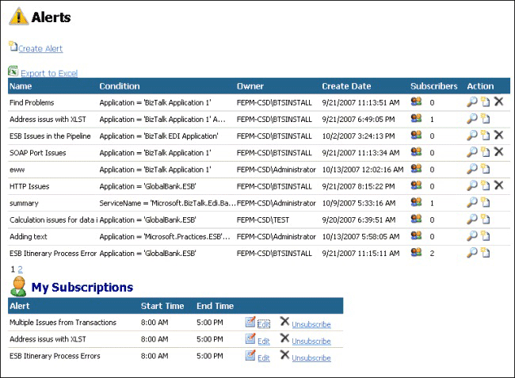

# Portal Alerts Page
Figure 1 shows the Alerts page, which contains two sections:  

- The main section displays a link to create a new alert and a list of existing alerts. Each alert has a corresponding link that allows you to subscribe to the alert. You can also click the icons in the Action column to view details of the alert, create a new subscription for the alert, and delete the alert.  

- The **My Subscriptions** section displays a list of subscriptions you have defined within the portal. You can edit and unsubscribe your existing subscriptions using the links in this list.  

    

  **Figure 1**  

  **The ESB Management Portal Alerts page**  

  The ESB Alert Service generates alerts based on criteria you specify that match the values in exceptions as they arrive at the ESB Management Portal. You can match and compare a range of fields in an exception to control accurately which alerts will match each possible type of exception. The portal also allows you to create subscriptions that map to the different types of alerts you define. These subscriptions can notify users when the matching alert occurs.  

  The following list explains how you can use the features of the ESB Management Portal Alerts page:  

- To create a new alert, click the **Create Alert** link at the top of the page to open the Add Alert page.  

- To view or edit an existing alert, click the magnifying glass icon in the Action column for the alert in the main section of the page. This opens the [Alert Viewer Page](../esb-toolkit/alert-viewer-page.md).  

- To subscribe to an existing alert, click the new subscription icon the Action column next to the alert to open the [Add Alert Subscription and Edit Subscription Pages](../esb-toolkit/add-alert-subscription-and-edit-subscription-pages.md).  

- If you opened this page as an administrator using the options on the **Admin** tab menu (instead of from the **Alerts** tab), you can click the cross mark icon the Action column next to any of the alerts in the list to delete the alert and any linked subscriptions.  

- To edit an existing subscription, click the **Edit** link next to that subscription in the list in the **My Subscriptions** section of the page to open the [Add Alert Subscription and Edit Subscription Pages](../esb-toolkit/add-alert-subscription-and-edit-subscription-pages.md).  

- To remove an existing subscription, click the **Unsubscribe** link next to that subscription in the list in the **My Subscriptions** section of the page.  

- To export the entire list of alerts to Microsoft Excel, click **Export to Excel**.
