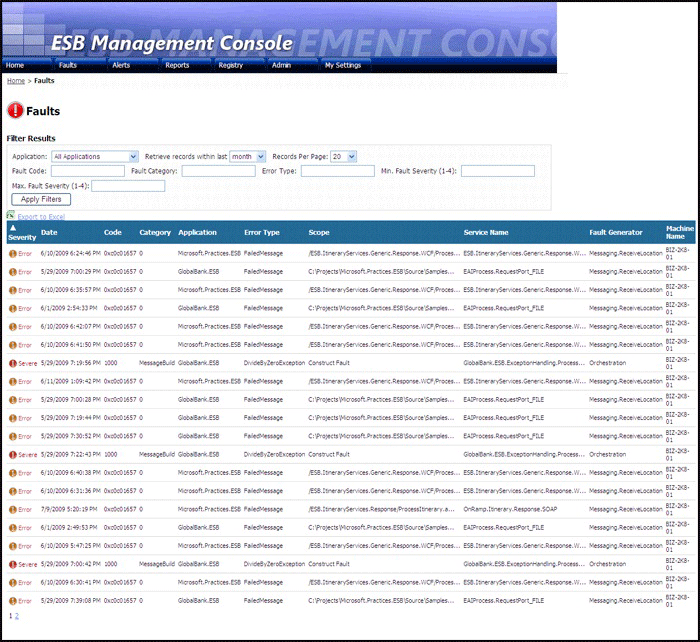

# Portal Faults Page
Figure 1 shows the Faults page. This page displays the main properties of each fault, and it provides sorting and filtering capabilities that support detailed analysis of faults over a range of criteria, such as error type and time. A link for each fault allows you to view more details in the Fault Message Viewer.  
  
   
  
 **Figure 1**  
  
 **The Faults page of the ESB Management Portal**  
  
 The following list explains how you can use the features of the ESB Management Portal Faults page:  
  
-   To filter the list of faults displayed in the page, use the drop-down lists and text boxes above the list of faults. You can filter the rows displayed in the following ways:  
  
    -   Select any one of the installed BizTalk applications in the **Application** drop-down list.  
  
    -   Specify the period within which the fault occurred by selecting **hour, day, week, month, quarter, year,** or **all** in the **Retrieve records within last** drop-down list.  
  
    -   Specify how many rows you want to display on the page in the **Records Per Page** drop-down list.  
  
    -   Type a fault code number in the **Fault Code** text box.  
  
    -   Type all or part of the fault category name in the **Fault Category** text box.  
  
    -   Type all or part of the error type text in the **Error Type** text box.  
  
    -   Type a value for the minimum and/or maximum fault severity (such as **Warning, Error, Severe,** or **Critical**) in the **Min Fault Severity** and **Max Fault Severity** text boxes.  
  
-   After you specify the values for one or more of these controls, click the **Apply Filters** button to apply all the specified criteria.  
  
-   Click a column heading to display the fault message rows in the order of that column contents, and then click again to display the list in reverse order.  
  
-   To display more details of a fault shown in the list, or to edit and resubmit the message it contains, click anywhere in the row for that fault to open it in the [Portal Fault Message Viewer](../esb-toolkit/portal-fault-message-viewer.md).