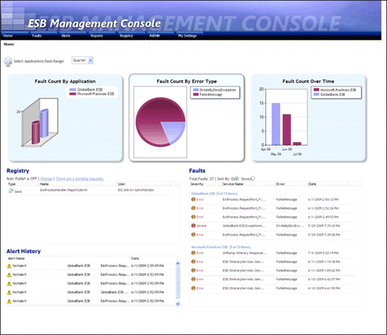

# Portal Home Page
Figure 1 shows the Home page, which contains four sections:  

- The **Charts** section contains a breakdown of faults by application, by type, and an analysis over time, indicating the overall health of the entire enterprise from an application perspective.  

- The **Registry** section contains a list of recent requests for service-endpoint publication sent to the Universal Description, Discovery, and Integration (UDDI) service.  

- The **Alert History** section displays a list of alerts received by the Alerts service.  

- The **Faults** section displays an abbreviated list of the most recent faults generated by the ESB Failed Orchestration Exception Routing mechanism and the BizTalk Failed Message Routing mechanism. The list shows faults grouped by application and displays the severity, service name, error type, and the date and time for each fault in the list.  

    

  **Figure 1**  

  **The Home page of the ESB Management Portal**  

  The following list explains how you can use the features of the ESB Management Portal Home page.  

- When you first load the Home page, you may not see any applications in the first chart. To select the applications for which you want to view information, click the **Select Applications** link above the first chart, and then select or clear the check boxes in the list of installed BizTalk applications that appears. You can also use the links that appear to select all or none of the applications. Click **Save** to show the information for the selected applications, or click **Cancel** to abandon your changes. You can change the default list of applications on the [Portal My Settings Page](../esb-toolkit/portal-my-settings-page.md).  

- To change the period for which the portal displays information, change the setting in the drop-down list above the first chart. You can chose to display information for the previous **Hour, Day, Week,** or **Month**. You can change the default period on the [Portal My Settings Page](../esb-toolkit/portal-my-settings-page.md).  

- To turn on or turn off auto-publishing of UDDI entries, click the **Change** link at the top of the **Registry** section of the page. This opens the [Registry Settings Page](../esb-toolkit/registry-settings-page.md), where you specify the following:  

  -   Details of the UDDI server the portal will use, including the URI of the server, whether auto-publishing is enabled, and whether anonymous access is enabled  

  -   Whether or not e-mail notification of UDDI publications are enabled, and the settings to use for the e-mail server, e-mail addresses, message subject, and message body.  

  -   Your contact name and e-mail address for published entries.  

- To view a list of pending UDDI registry requests, click the link at the top of the **Registry** section of the page that shows the number of pending requests. This opens the [Manage Pending Requests Page](../esb-toolkit/manage-pending-requests-page.md), which contains the following:  

  -   **A list of pending registration requests**. For each one, you can click the icons to the right of that request to view the details, approve the request, or reject the request. When viewing the request, you see the details of the registry, the details of the registry service (which you can edit), and contact details.  

  -   **A link to display a history of requests as a list**. This list shows a range of values from each registration request.  

- To change the sort order of the faults listed in the **Faults** section of the page, click either the **Date** or the **Severity** option button located above the list of faults.  

- The portal displays faults in the **Faults** section of the page grouped by BizTalk application. To see the faults for only a specific application, click the link that is the name of the application above the relevant group of faults.  

- To view details of a specific fault, click anywhere in the row containing that fault in the **Faults** section of the page. This opens the [Portal Fault Message Viewer](../esb-toolkit/portal-fault-message-viewer.md) for the selected fault.
