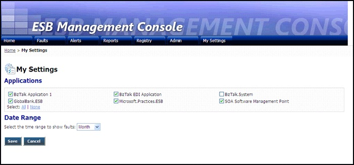

# Portal My Settings Page
The ESB Management Portal retains settings for each user. These settings include the list of applications to show in the charts on the [Portal Home Page](../esb-toolkit/portal-home-page.md), and the default period for the charts. Figure 1 shows the My Settings page, where you can edit these settings.  
  
   
  
 **Figure 1**  
  
 **The ESB Management Portal My Settings page**  
  
 The following list explains how you can use the features of the ESB Management Portal My Settings page:  
  
-   Select the check boxes for each of the currently installed Microsoft BizTalk Server applications for which you want to include fault data in the charts in the portal Home page. The portal uses this list as the default when you open the Home page, but you can change it using a link in the Home page on a per-session basis.  
  
-   Select the default interval over which you want to show data in the charts on the Home page. You can choose to include data for the previous **Hour, Day, Week, Month, Quarter, Year,** or **ALL**. The portal uses this value as the default when you open the Home page, but you can change it using a drop-down list in the Home page on a per-session basis.  
  
-   Click the **Save** button to update your default settings.  
  
-   Click the **Cancel** button to return to the previous page without updating your settings.