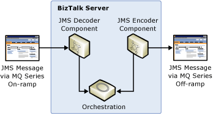

# Preserving JMS Headers When Routing Through an Orchestration
In this use case, components provided with [!INCLUDE[esbToolkit](../includes/esbtoolkit-md.md)] extract Java Message Service (JMS) headers from an incoming message and then reconstructs them in the outgoing message. This demonstrates JMS message header preservation and access to header context from inside an orchestration, as illustrated in Figure 1.  
  
   
  
 **Figure 1**  
  
 **Preserving JMS header information throughout an ESB orchestration and processing**  
  
 The JMS MQRFH2 Component sample included with the [!INCLUDE[esbToolkit](../includes/esbtoolkit-md.md)] demonstrates this use case and consists of the following three parts:  
  
- Part 1 demonstrates full-fidelity header preservation as a message travels from IBM WebSphere MQ, through ESB and BizTalk Server, and back to IBM WebSphere MQ.  
  
- Part 2 demonstrates how code in an ESB orchestration can access MQRFH2 header properties. In this case, the code modifies a JMS header property to specify the destination queue name.  
  
- Part 3 demonstrates bulk loading a queue with messages and shows how the application routes messages to the destination queues specified as part of the message content.  
  
  For more information, see [Installing and Running the JMS MQRFH2 Component Sample](../esb-toolkit/installing-and-running-the-jms-mqrfh2-component-sample.md).