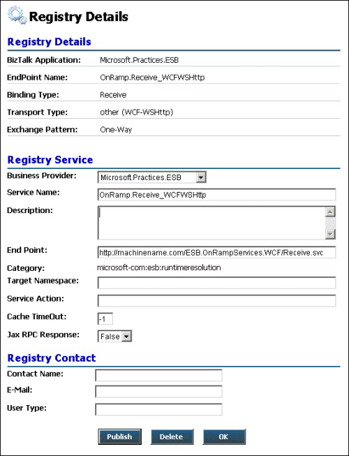

# Registry Details Page
Figure 1 shows the Registry Details page, where you can publish an existing Universal Description, Discovery, and Integration (UDDI) registry request, create a new request, or edit an existing request.  
  
   
  
 **Figure 1**  
  
 **The ESB Management Portal Registry Details page**  
  
 The following list explains how you can use the features of the ESB Management Portal Registry Details page:  
  
-   The **Registry Details** section at the top of the page shows registry information. To change this information, you can use the [Registry Settings Page](../esb-toolkit/registry-settings-page.md) available on the main **Registry** tab.  
  
-   The **Registry Service** section of the page contains drop-down lists and text boxes where you enter details of the service you want to register. These details include the business provider; the service name and description; and information about the category and the endpoint.  
  
-   The **Registry Contact** section of the page contains text boxes where you enter the request contact details; including the name, e-mail address, and the type of user.  
  
-   If you opened the Registry Details page from the [Manage Pending Requests Page](../esb-toolkit/manage-pending-requests-page.md), the Registry Details page contains buttons that allow you to publish the pending registration, delete the pending registration, or update it and go back to the previous page.  
  
-   If you opened the Registry Details page from the [New Registry Entry Page](../esb-toolkit/new-registry-entry-page.md), the Registry Details page contains buttons that allow you to publish the pending registration or update it and go back to the previous page.
