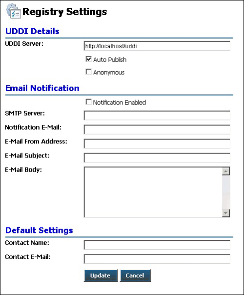

# Registry Settings Page
Figure 1 shows the Registry Settings page, where you can modify the settings the portal uses when it interacts with the Universal Description, Discovery, and Integration (UDDI) service.  
  
   
  
 **Figure 1**  
  
 **The ESB Management Portal Registry Settings page**  
  
 The following list explains how you can use the features of the ESB Management Portal Registry Settings page:  
  
-   The **UDDI Details** section at the top of the page contains a text box for the URI or URL of the UDDI server, the default is the local Microsoft UDDI Service. There are two check boxes under this section that allow you to turn on auto-publication of requests for UDDI registrations and specify if access to the UDDI server will be through an anonymous account instead of the current user's Microsoft Windows account.  
  
-   The **Email Notification** section of the page contains a check box that you select if you want the portal to send you e-mail notifications of registration requests automatically. Under this check box, there is a series of text boxes where you provide details of the e-mail server to use, the "to" and "from" e-mail addresses, the message subject, and the message body.  
  
-   The **Default Settings** section of the page contains text boxes where you enter the default contact and e-mail address for use in the portal registration process.  
  
-   To update the registry settings after editing the values in the page, click the **Update** button.  
  
-   To return to the previous page without changing the registry settings, click the **Cancel** button.
