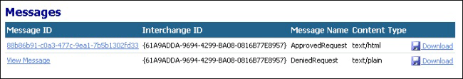
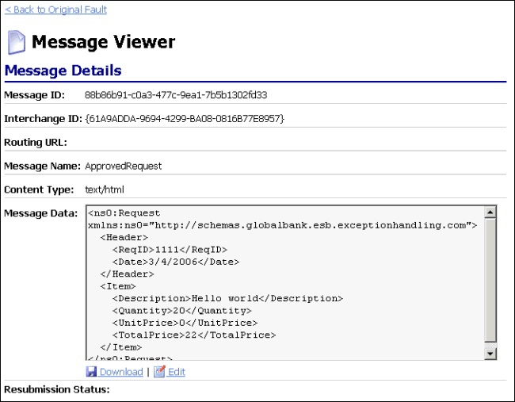
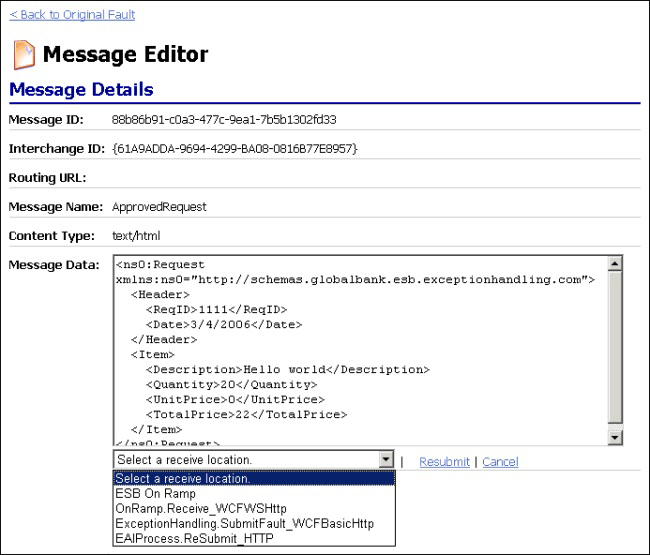
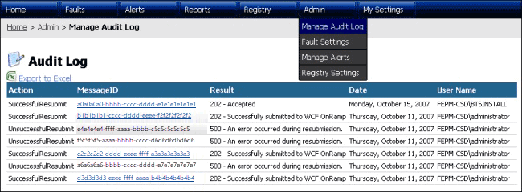

# Repairing and Resubmitting a Message
To repair and resubmit a failed message, use the Faults page of the ESB Management Portal.  
  
### To repair and resubmit a message for processing  
  
1.  Locate the desired fault message on the [Portal Faults Page](../esb-toolkit/portal-faults-page.md) page of the ESB Management Portal. Use the filtering capabilities on the Faults page to search for a specific message. Leave any of the controls empty to retrieve all messages. Note that filtering on a very large fault database may take several seconds to display the appropriate results. Figure 1 illustrates the Faults page.  
  
       
  
     **Figure 1**  
  
     **The Faults page of the ESB Management Portal**  
  
2.  Click anywhere in the row of the desired fault message to open the [Portal Fault Message Viewer](../esb-toolkit/portal-fault-message-viewer.md) page in [Fault Details View](../esb-toolkit/fault-details-view.md).  
  
3.  Scroll to the bottom of the Fault Details view to the list of messages contained within the fault message. Figure 2 illustrates the **Messages** section of the Fault Viewer page.  
  
       
  
     **Figure 2**  
  
     **The Messages section of the Fault Viewer page of the ESB Management Portal**  
  
4.  Click the message identifier of the message you want to resubmit. This opens the message in [Message Details View](../esb-toolkit/message-details-view.md), which shows details of the individual message and the message content, as illustrated in Figure 3.  
  
       
  
     **Figure 3**  
  
     **The Message Viewer page of the ESB Management Portal**  
  
5.  Click the **Edit** link under the text box that contains the message content to switch to edit mode, and then edit the message contents as required. For example, you may need to change the parameters for service method invocations contained within the message. Note that you must adhere to the native document style (such as XML or flat file format) to prevent rejection of the message when resubmitted. Figure 4 illustrates the **Message Details** section of the Message Editor page.  
  
       
  
     **Figure 4**  
  
     **The Message Details section of the Message Viewer page of the ESB Management Portal**  
  
6.  After editing the message, select a resubmission location in the drop-down list under the message text box. This list shows the dynamically retrieved list of available endpoints. You must select an endpoint configured as a resubmission endpoint. The following endpoints are suitable for resubmission:  
  
    -   **WCF On-Ramp**. This endpoint is the ESB Itinerary Services WCF on-ramp and is available only for XML files. The portal Web.config file defines the URL for this on-ramp.  
  
    -   **SOAP On-Ramp**. This endpoint is the ESB Itinerary Services ASMX on-ramp and is available only for XML files. The portal Web.config file defines the URL for this on-ramp.  
  
    -   **Any receive location using the BizTalk HTTP adapter**. This option is available for XML files and flat files.  
  
7.  Click the **Resubmit** link to resubmit the message. A message indicating the **Resubmission Status** appears under the message content text box.  
  
8.  If required, open the [Audit Log Page](../esb-toolkit/audit-log-page.md) from the **Admin** tab to confirm message resubmission, as illustrated in Figure 5.  
  
       
  
     **Figure 5**  
  
     **The Audit Log page of the ESB Management Portal**
