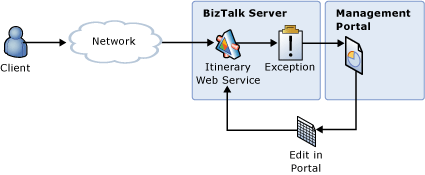

# Repairing and Resubmitting Messages Using the ESB Management Portal
In this use case, a preconfigured send port uses the ESB Fault Processor send pipeline to receive an ESB fault message generated by the exception handler in an orchestration or a fault message generated by the Failed Message Routing mechanism in Microsoft BizTalk Server. The ESB Fault Processor normalizes, enriches, and routes it to the ESB Management Portal database. The portal monitors the database for incoming fault messages and can generate alerts that notify subscribed users of the processing failure. A user can open the fault message in the portal Fault Viewer, edit the message contents, and resubmit the message for processing, as illustrated in Figure 1.  
  
   
  
 **Figure 1**  
  
 **Repairing and resubmitting messages using the ESB Management Portal**  
  
 The ESB Management Portal included as a sample with the [!INCLUDE[esbToolkit](../includes/esbtoolkit-md.md)] demonstrates this use case. It provides a full graphical environment for editing and resubmitting messages; it also supports alerts, notifications, and message resubmission auditing.  
  
 For more information, see [Working with Exceptions and Fault Messages](../esb-toolkit/working-with-exceptions-and-fault-messages.md).