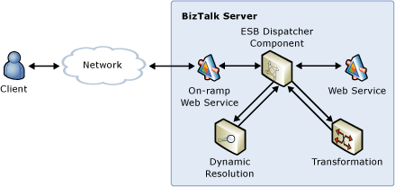

# Request-Response Resolution of Endpoints and Transformation Requirements
In this use case, a client application submits a request message to an on-ramp and receives a response. The [!INCLUDE[esbToolkit](../includes/esbtoolkit-md.md)] acts as mediator between the client and the target service endpoint and uses the ESB Resolver and Adapter Framework to perform the dynamic message transformation and routing in accordance with the on-ramp configuration, as illustrated in Figure 1.  
  
   
  
 **Figure 1**  
  
 **Request-response resolution of endpoints and transformation requirements**  
  
 The Dynamic Resolution sample included with the [!INCLUDE[esbToolkit](../includes/esbtoolkit-md.md)] demonstrates this use case. It shows how to apply dynamic transformation and resolution for two-way scenarios using XML Path Language (XPath), Universal Description, Discovery, and Integration (UDDI), STATIC, or policies in the BizTalk Server Business Rules Engine.  
  
 For more information, see the two-way messaging scenario described in [Installing and Running the Dynamic Resolution Sample](../esb-toolkit/installing-and-running-the-dynamic-resolution-sample.md).
