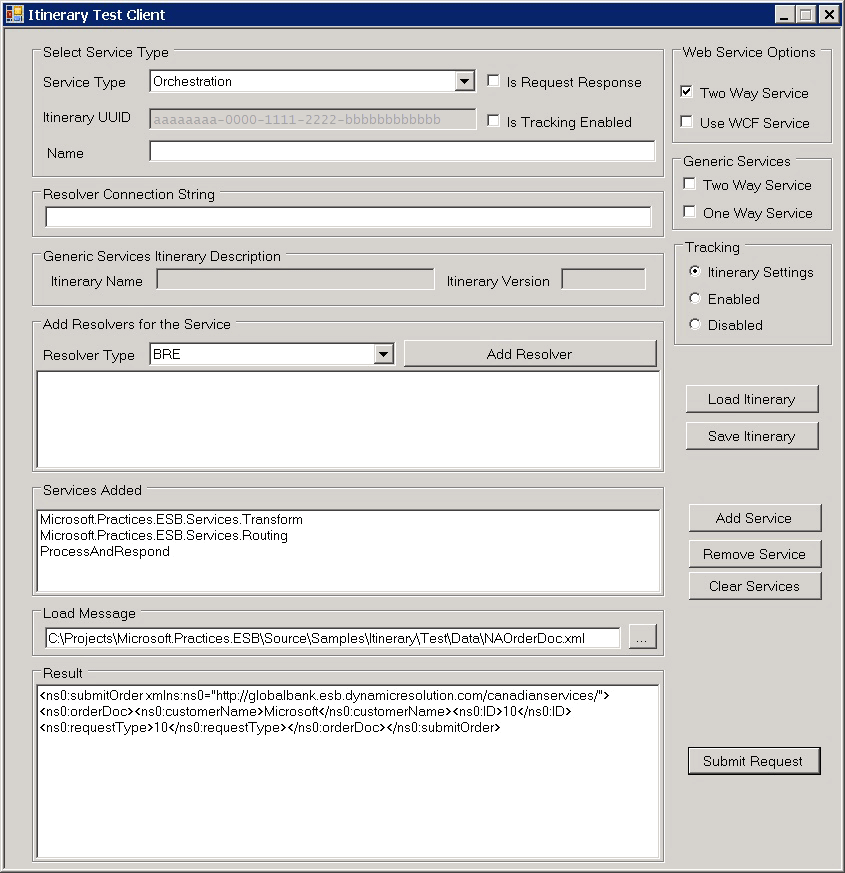
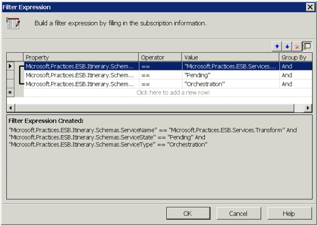

# Run a Predefined Itinerary On-Ramp Sample
The [!INCLUDE[esbToolkit](../includes/esbtoolkit-md.md)] includes 20 predefined Itinerary use cases you can execute. For a list of these use cases, see [The Sample Itinerary Scenarios](../esb-toolkit/the-sample-itinerary-scenarios.md).  
  
> [!NOTE]
>  Before you run any of the samples, you must manually import the appropriate itinerary binding file from the \Source\Samples\Itinerary\Install\Binding folder into the GlobalBank.ESB BizTalk application. This binding file resets the properties on the two dynamic send ports. Import the binding file named GlobalBank.ESB.Itinerary_Bindings.xml.  
  
### To run one of the pre-defined Itinerary On-Ramp samples  
  
1. If the GlobalBank.ESB application is not already running, use the BizTalk Administration Console to start it.  
  
2. In Windows Explorer, open the subfolder \Source\Samples\Itinerary\Source\ESB.Itinerary.Test\bin\Debug where you installed the BizTalk ESB Toolkit samples, and then start the application named Esb.Itinerary.Test.exe.  
  
3. Click the **LoadItinerary** button, and then select the sample itinerary named TwoWay-OrchTransform-OrchRoutingGroup-OrchTwoWayCustom.xml from the \Source\Samples\Itinerary\Itineraries folder.  
  
4. In the **Web Service Options** section, select the **Two-Way Service** check box. This instructs the test client to perform a request-response itinerary service operation.  
  
5. (Optional) Select the **Use WCF Service** check box if you want the application to use the OnRamp.Itinerary.Response.WCF receive location instead of the default OnRamp.Itinerary.Response.SOAP receive location.  
  
6. Click the **LoadMessage** button, and then select the NAOrderDoc.xml sample message from the \Source\Samples\Itinerary\Test\Data folder.  
  
7. Click the **SubmitRequest** button to send the request to the Itinerary On-Ramp service. Figure 1 shows the result.  
  
     
  
   **Figure 1**  
  
   **The Itinerary On-Ramp client application running one of the Itinerary On-Ramp samples**  
  
   The name of the service specified in the itinerary definition corresponds directly to the **ServiceName** property of the service to which the sample subscribes. In the itinerary sample executed in the previous procedure (TwoWay-OrchTransform-OrchRoutingGroup-OrchTwoWayCustom.xml), the first service executed is an orchestration-based service that performs a transformation. The following section of the itinerary specifies this service.  
  
```  
<Service uuid="" beginTime="" completeTime=""   
    name="Microsoft.Practices.ESB.Services.Transform"  
    type="Orchestration" state="Pending" isRequestResponse="false"  
    position="0" serviceInstanceId="" />  
```  
  
 The orchestration service in this **\<Service\>** element specifies the direct-bound orchestration that has the filter properties shown in Figure 2. Notice that the orchestration subscribes only to messages that have the value **Microsoft.Practices.ESB.Services.Transform** for the **ServiceName** context property, the value **Pending** for the **ServiceState** context property, and the value Orchestration for the **ServiceType** context property.  
  
   
  
 **Figure 2**  
  
 **The filter expression for the direct-bound orchestration used in the Itinerary On-Ramp sample**