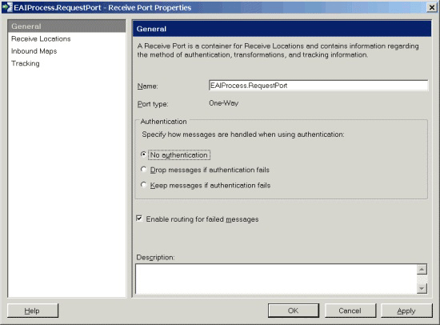
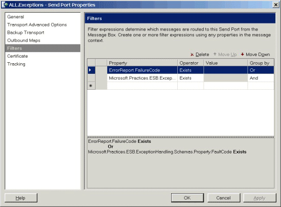

# Running the BizTalk Failed Message Routing ESB Processing Sample
The Microsoft BizTalk Failed Message Routing ESB Processing sample demonstrates how you can use the [!INCLUDE[esbToolkit](../includes/esbtoolkit-md.md)] Exception Management Framework as a universal mechanism to manage, serialize, and render exceptions occurring under all conditions in BizTalk Server. This includes exceptions generated by the BizTalk Failed Message Routing mechanism and fault messages generated by the Exception Management Framework from within an orchestration.  
  
 The BizTalk Failed Message Routing mechanism is the error-handling facility of BizTalk Server; by using it, the designer can designate automated handling of messaging failures as an alternative to the traditional (now default) behavior of placing failed messages in the "Suspended" queue. This automated handling routes an error message to any subscribing routing destination, such as a send port or an orchestration. The error message is a clone of the original message with all previously promoted properties demoted and with selected properties related to the specific messaging failure promoted into the message context.  
  
 To enable the BizTalk Failed Message Routing mechanism on a receive port or a send port, select the **Enable routing for failed messages** check box, as shown in Figure 1.  
  
   
  
 **Figure 1**  
  
 **Enabling the BizTalk Failed Message Routing mechanism**  
  
 However, there is not a similar mechanism for errors or failures occurring in an orchestration. Instead, code within the exception handler of an orchestration can take advantage of the Exception Management Framework API to emulate the functionality of the BizTalk Failed Message Routing mechanism.  
  
 In this sample, the receive location named EAIProcess.RequestPort_FILE picks up files copied to the location \Source\Samples\Exception Handling\Test\Filedrop\EAIProcess.RequestPort.  
  
 Additionally, there is a generic send port named ALL.Exceptions_FILE configured to use the GlobalFaultProcessor pipeline installed as part of the Exception Management Framework. This port subscribes to all exceptions occurring in the system, both BizTalk failed message routing messages and ESB fault messages, as shown in Figure 2.  
  
   
  
 **Figure 2**  
  
 **The ALL.Exceptions send port subscription for all types of failure or exception**  
  
 The Exception Management Framework normalizes all exceptions to a single format and serializes them using a Microsoft InfoPath processing instruction to the location \Source\Samples\Exception Handling\Test\Filedrop\All_Exceptions.  
  
## Installation  
 All the exception management samples use the same set of core services and BizTalk application artifacts. Therefore, you have to install the exception management sample artifacts only once to be able to run all the exception management samples. For information about how to install the exception management samples, see [Installing the Exception Management Samples](../esb-toolkit/installing-the-exception-management-samples.md).  
  
## Running the Sample Application  
 **To run the BizTalk Failed Message Routing ESB Processing sample**  
  
1.  Before you run this sample for the first time, make sure that the receive location and send port URL point to the appropriate directories in the \Source\Samples\Exception Handling\Test\Filedrop folder. The receive location should specify the folder EAIProcess.RequestPort, and the send port URL should specify the folder All_Exceptions.  
  
2.  If the GlobalBank.ESB application is not already running, use the BizTalk Administration Console to start it.  
  
3.  Copy the file named FlatFileReceive_in.txt from the folder \Source\Samples\Exception Handling\Test\Data into the receive location folder named EAIProcess.RequestPort (in the \Source\Samples\Exception Handling\Test\Filedrop folder).  
  
4.  This message is a text file, and it will cause an exception. Open the folder named All_Exceptions (in the \Source\Samples\Exception Handling\Test\Filedrop folder), and then double-click the fault message to open it into InfoPath using the appropriate template. You will see that the ESB Exception Handling mechanism serializes the content appropriately to allow InfoPath to render it.  
  
5.  Next, copy the file named soapmessage[1].xml from the folder \Source\Samples\Exception Handling\Test\Data into the EAIProcess.RequestPort receive location folder.  
  
6.  This message is an XML document that contains a CDATA section, and it will cause an exception. Open the All_Exceptions output folder and double-click the fault message to open it into InfoPath. You will see that the ESB Exception Handling mechanism serializes this content appropriately to allow InfoPath to render it.  
  
7.  Finally, copy the file named Csqzav01.pdf from the folder \Source\Samples\Exception Handling\Test\Data into the EAIProcess.RequestPort receive location.  
  
8.  This message is a PDF file, and it will cause an exception. Open the All_Exceptions output folder and double-click the fault message to open it in InfoPath. You will see that the ESB Exception Handling mechanism serializes and Base-64 encodes the content to allow InfoPath to render it.
