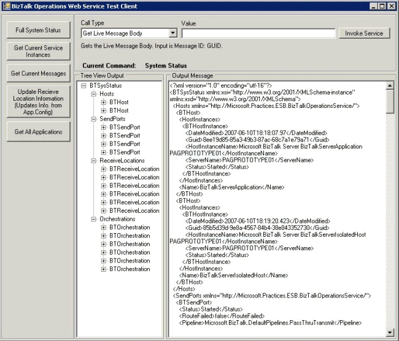

# Running the BizTalk Operations Sample
The Microsoft BizTalk Operations sample uses a Windows Forms test client application to execute methods of the BizTalk Operations Web service and display the results. You can open the test client project to run it and to examine the code to see how you can use the BizTalk Operations Web service in your own service-oriented architecture (SOA) and ESB applications.  
  
 In Windows Explorer, open the folder named \Samples\BizTalkOperations\bin\Debug, and then execute the application Microsoft.Practices.ESB.BizTalkOperations.Test.Client.exe.  
  
 Figure 1 shows the test client application for the BizTalk Operations Web service. You can execute all the functions of the BizTalk Operations Web service using this application. The application displays the results in a tree-view format and shows the message returned by the service.  
  
   
  
 **Figure 1**  
  
 **The BizTalk Operations Web Service Test Client**  
  
 To execute a method of the BizTalk Operations Web service that does not require any parameters, simply click the appropriate button in the left side of the application window. For methods that do require input parameters, select the method in the drop-down list at the top of the window, enter the parameter values you require, and then click the **Invoke Service** button.  
  
## How the Sample Works  
 The sample application instantiates the ESB BizTalk Operations Web service and calls the appropriate method depending on the settings you select in the application. It passes the value(s) you enter in the application controls as parameters to the selected service method, and it collects the output from the service method to display in the application window.
