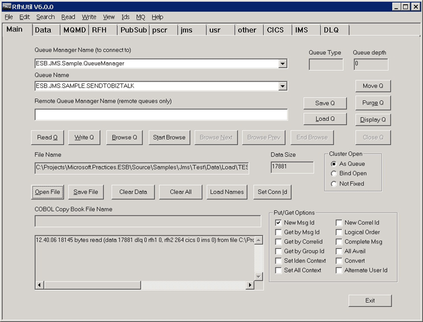
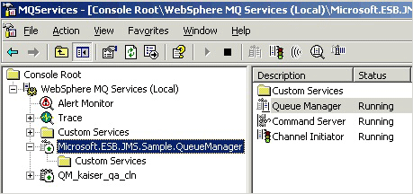

# Running the JMS MQRFH2 Header Preservation Sample
This part of this sample deposits a message into a WebSphere queue. The ESB picks up this message and deposits it into an outbound WebSphere queue. This demonstrates that the ESB and Microsoft BizTalk preserve full-fidelity RFH2 headers as a message travels through BizTalk Server.  
  
 **To run the Header Preservation sample**  
  
1.  If the GlobalBank.ESB application is not already running, use the BizTalk Administration Console to start it.  
  
2.  Run the IBM RfhUtil utility, and then select the queue manager named ESB.JMS.Sample.QueueManager in the first drop-down list to connect to this queue manager.  
  
3.  In the second drop-down list, select the target outbound queue named ESB.JMS.SAMPLE.SENDTOBIZTALK, as shown in Figure 1.  
  
       
  
     **Figure 1**  
  
     **Connecting to the queue manager and the outbound queue in RfhUtil**  
  
4.  If the drop-down list does not contain any queues, make sure that the queue manager is running by checking the WebSphere MQ Services item, as shown in Figure 2.  
  
       
  
     **Figure 2**  
  
     **Checking that the queue manager is running in the WebSphere Services item**  
  
5.  Click the **ReadFile** button in the RfhUtil utility and navigate to the test message file named TEST-000128.JMS located in the subfolder named \Source\Samples\JMS\Test\Data\Load\\. This file contains a batch of 128 test messages, but the utility loads only the first one.  
  
6.  Click the **RFH** tab, and then make sure that only the **JMS** check box is selected.  
  
7.  Click the **jms** tab, and then make sure that the selected **Reply To** queue is ESB.JMS.SAMPLE.DYNAMICQ1 and that the selected **Destination Queue** is ESB.JMS.SAMPLE.DYNAMICQ2.  
  
8.  Click the **Main** tab, and then click the **Write Q** button to write the message into the queue.  
  
9. After a delay while the application executes, the ESB output message appears in the ESB.JMS.SAMPLE.DYNAMICQ1 and ESB.JMS.SAMPLE.DYNAMICQ1 queues. Open the WebSphere Queue Explorer and browse the queues to confirm this.  
  
10. Go back to the RfhUtil utility and connect to the queues to see the messages. Click the **MQMD, RFH,** and **jms** tabs to verify that the input and output values are unchanged for the message in the Destination Queue, and that the message in the Reply To queue is the same except that, instead of being a standard JMS message, the message is marked as "other".