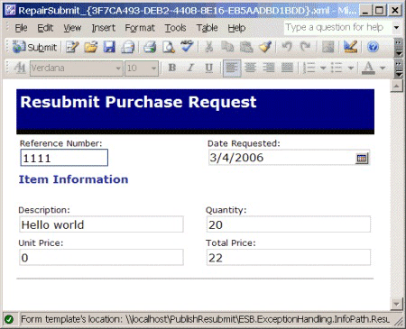

# Running the Repair and Resubmit Custom Exception Handler Sample
The Repair and Resubmit Custom Exception Handler sample demonstrates an extremely effective technique for integrating human intervention into ESB and Microsoft BizTalk–based application processes and implements a useful design pattern. The sample code integrates seamlessly into the ESB exception management system.  
  
 The sample shows how you can use a custom exception handler in an orchestration. When a process in the orchestration (EAIProcess.odx) encounters an error, the exception handler generates and publishes an ESB fault message. This fault message includes in its payload the messages (including their BizTalk-related context properties) that were "in flight" when the exception occurred and the current System.Exception instance caught by the BizTalk Orchestration engine. When this occurs, a "Denied" message and an "Approved" message are persisted with the fault message.  
  
 A second orchestration named EAIProcessHandler.odx, which is deployed in a decoupled manner and acts as a custom exception handler, subscribes to the specific fault code generated in the EAIProcess.odx orchestration and consumes the fault message. This exception handler extracts the original messages (as typed documents) and the System.Exception instances originally persisted in the fault message.  
  
 The original messages now become available for processing with all their original context properties. The custom exception handler (EAIProcessHandler.odx) then writes both the "Denied" and the "Approved" messages to the file system in the following locations:  
  
- Approved message:  
  
  -   \Source\Samples\Exception Handling\Test\Filedrop\EAIProcess.PostApproval  
  
- Denied message for repair and resubmit:  
  
  -   \Source\Samples\Exception Handling\Test\Filedrop\EAIProcessHandler.RepairSubmit  
  
- Denied message:  
  
  -   \Source\Samples\Exception Handling\Test\Filedrop\EAIProcessHandler.PostDecline  
  
  The exception handler serializes the "Denied" message for Repair and Resubmit to the file system using a Microsoft InfoPath processing instruction. An InfoPath template allows the user to edit the form and resubmit the result (see Figure 1), which starts the EAIProcess.odx orchestration that validates the message.  
  
    
  
  **Figure 1**  
  
  **A test message generated by the InfoPath Repair and Resubmit template**  
  
  Additionally, there is a generic send port named ALL.Exceptions_FILE that is configured to use the GlobalFaultProcessor pipeline. This port subscribes to all exceptions in the system, both BizTalk failed message routing messages and ESB fault messages. The Exception Management Framework normalizes them all to a single format and serializes them using an InfoPath processing instruction to the folder \Source\Samples\Exception Handling\Test\Filedrop\All_Exceptions.  
  
## Installation  
 All the exception management samples use the same set of core services and BizTalk application artifacts. Therefore, you have to install the exception management sample artifacts only once to be able to run all the exception management samples. For information about how to install the exception management samples, see [Installing the Exception Management Samples](../esb-toolkit/installing-the-exception-management-samples.md).  
  
## Running the Sample Application  
 **To run the Repair and Resubmit Custom Exception Handler sample**  
  
1.  Before you run this sample for the first time, make sure that the receive location and send port URLs point to the appropriate directories in the \Source\Samples\Exception Handling\Test\Filedrop folder. The receive location should specify the folder EAIProcess.RequestPort, and the send port URLs should specify the folders EAIProcess.PostApproval and EAIProcessHandler.PostDecline.  
  
2.  If the GlobalBank.ESB application is not already running, use the BizTalk Administration Console to start it.  
  
3.  Start the sample by copying the sample file named Request_EAIProcessHandler.xml, located in the \Source\Samples\Exception Handling\Test\Data folder, to the folder specified for the EAIProcess.RequestPort_FILE receive location: \Source\Samples\Exception Handling\Test\Filedrop\EAIProcess.RequestPort.  
  
4.  Open the folder named EAIProcessHandler.PostDecline (in the \Source\Samples\Exception Handling\Test\Filedrop folder). You will see the "Declined*" message generated by the exception handling orchestration.  
  
5.  Open the folder named EAIProcessHandler.RepairSubmit (in the \Source\Samples\Exception Handling\Test\Filedrop folder). You will see a "RepairSubmit" message generated by the exception handling orchestration.  
  
6.  Double-click the RepairSubmit file to open it in the appropriate InfoPath template. You will see the message ready for edit and resubmission.  
  
7.  Change the value of the **Unit Price** field from **0** to **2**, and then click the **Submit** button located on the toolbar of the InfoPath form to submit the edited document back to BizTalk for processing. The submit process uses a BizTalk-configured HTTP receive location.  
  
8.  Navigate to the EAIProcess.PostApproval folder (in the \Source\Samples\Exception Handling\Test\Filedrop folder). You will now see the "Approval*" document containing the updated value for the unit price.  
  
## How the Sample Works  
 The message you submit activates the EAIProcess orchestration. When the EAIProcess orchestration processes the message, it attempts to divide 1 by the unit price. Because the unit price is zero, a divide-by-zero exception occurs. Code in the event handler of the orchestration catches this exception and creates a fault message. The order quantity in the message is greater than 10, so the business logic dictates that this exception has a **FaultCode** field value of **1000**.  
  
 The EAIProcess orchestration then publishes the fault message to the BizTalk Message Box through a direct-bound port, and the orchestration ends.  
  
 A custom fault handler orchestration named EAIProcessHandler, which subscribes to messages with a **FaultCode** field value of **1000**, picks up the new fault message. The code in the orchestration creates the "Denied" message and the InfoPath file, and then it places this into the EAIProcessHandler.PostDecline and EAIProcessHandler.RepairSubmit folders ready for human intervention.