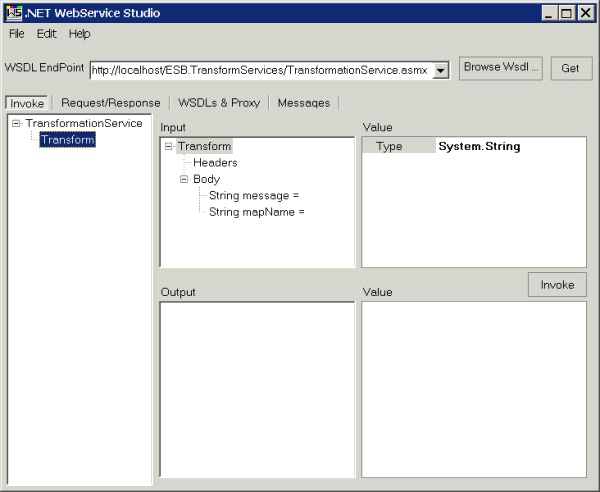

# Running the Transformation Service Sample
You can execute the Transformation Service sample using any tool or utility that can execute Web service methods. For example, you can use Storm, available from [CodePlex](https://go.microsoft.com/fwlink/?LinkId=187762) ([http://go.microsoft.com/fwlink/?LinkId=187762](https://go.microsoft.com/fwlink/?LinkId=187762)), or you can create your own test client that invokes the Transformation Web service.

 To use the .NET Web Service Studio to test for correct installation of the Transformation Service sample, enter the URL for the ASMX-based Transformation Web service into the **WSDL EndPoint** text box, and then click the **Get** button. This generates a client front-end interface that you can use to call the ESB Transformation Web Service, as shown in Figure 1.

 

 **Figure 1**

 **Using the .NET Web Service Studio to test the Transformation Service sample**

 The Transformation Service sample contains two Microsoft BizTalk maps and two test XML message documents. You can execute the Transformation Web service with the XML messages named TEST_CanonicalOrder_to_OrderConfirmation.xml and TEST_RetailOrder_to_CanonicalOrder.xml (located in the \Source\Samples\TransformServices\Test\Data folder).

 The service will automatically transform the messages using the schemas CanonicalOrder.xsd and RetailOrder.xsd and OrderConfirmation.xsd (located in the \Source\Samples\TransformServices\Source\ESB.TransformServices.Schemas folder), and .NET Web Service Studio will display the resulting transformed messages. The following procedure shows how you can test the CanonicalOrder_To_OrderConfirmation map.

 **To test the GlobalBank.ESB.TransformServices.Maps.CanonicalOrder_To_OrderConfirmation map**

1.  If the GlobalBank.ESB application is not running, use the BizTalk Administration Console to start it.

2.  Enter the following string representation of the TEST_CanonicalOrder_to_OrderConfirmation.xml file as the value of the **message** parameter in the **Input** tree view of .NET Web Service Studio. This string conforms to the GlobalBank.ESB.TransformServices.Schemas.CanonicalOrder schema:

    ```
    <ns0:CanonicalOrder OrderID="OrderID_0" OrderDate="OrderDate_1"
        Status="Status_2" xmlns:ns0=
        "http://schemas.globalbank.esb.transformservices.com">
        <OrderHeader><CustomerName>CustomerName_0</CustomerName>
        <CustomerID>CustomerID_0</CustomerID><ShipToLine1>
        ShipToLine1_0</ShipToLine1><ShipToLine2>ShipToLine2_0
        </ShipToLine2><BillToLine1>BillToLine1_0</BillToLine1>
        <BillToLine2>BillToLine2_0</BillToLine2><OrderTotal>OrderTotal_0
        </OrderTotal></OrderHeader><OrderDetails><LineItem Qty="Qty_0"
        PartNum="PartNum_1" Description="Description_2"
        UnitPrice="UnitPrice_3" Ext="Ext_4" /></OrderDetails>
        <B2BPartnerDetails CreditLimit="CreditLimit_0"
        AccountBalance="AccountBalance_1"
        LastOrderedData="LastOrderedData_2"
        DiscountLevel="DiscountLevel_3" /></ns0:CanonicalOrder>
    ```

3.  Enter the following string as the value of the **mapName** parameter in the **Input** tree view of .NET Web Service Studio. This is the fully typed name of the BizTalk map to execute against the message:

    ```
    GlobalBank.ESB.TransformServices.Maps.CanonicalOrder_To_
        OrderConfirmation, GlobalBank.ESB.TransformServices.Maps,
        Version=1.0.0.0, Culture=neutral, PublicKeyToken=<insertYourPublicKeyTokenHere>
    ```

4.  Click the **Invoke** button to execute the Web service. The **Output** test box displays the results.