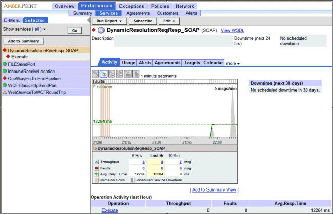
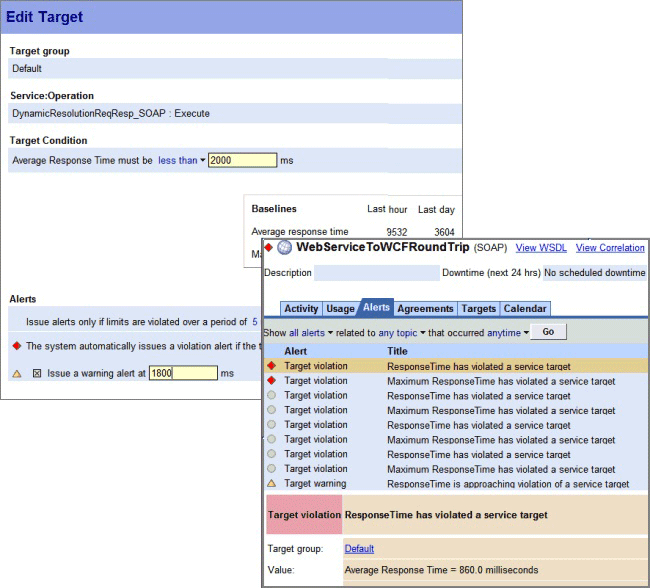
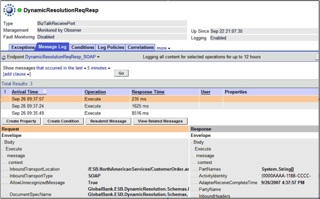

# Service Level Management
The AmberPoint SMS Service Level Manager provides visibility into specific performance and availability issues within enterprise-level SOA-based systems. It instruments and tracks the metrics for each Microsoft BizTalk Server receive location and send port. This provides real-time health and status indication, in addition to ongoing performance characterization of these components. Figure 1 shows the display of the metrics associated with a receive location.  
  
   
  
 **Figure 1**  
  
 **The metrics associated with a receive location**  
  
 AmberPoint run-time analytics allow users to set thresholds and send alerts when a system crosses a critical event threshold, including compliance warnings events, compliance violations events, and a subsequent return to compliance. Figure 2 shows the display where users configure service level agreements and view alerts generated for this service level agreement.  
  
   
  
 **Figure 2**  
  
 **The screens to configure a service level agreement and view alerts**  
  
 You can establish performance targets within the Service Level Manager. The software then tracks individual messages, messages from a specific user, or messages from groups of users, to measure performance against these targets.  
  
 You can also configure logging policies that instruct AmberPoint SMS to dynamically collect and inspect message context and data passing through BizTalk Server, as shown in Figure 3. You can then use these logs for "on-the-fly" troubleshooting, for technical analysis of problems, and for archiving to comply with industry-specific regulations.  
  
   
  
 **Figure 3**  
  
 **The log file for BizTalk Server service messages**
