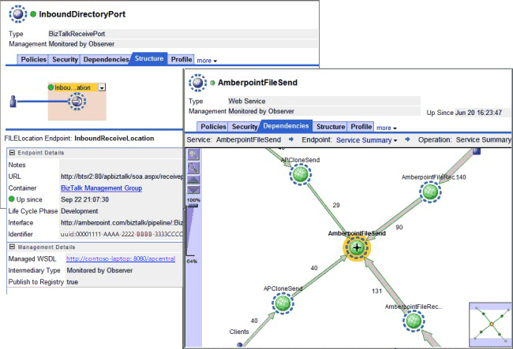

# Service Network Management
Effective run-time governance requires knowledge of the services deployed into the run-time environment. AmberPoint SMS can discover the actual receive locations and send ports deployed within a BizTalk Management Group, as shown in Figure 1.  
  
   
  
 **Figure 1**  
  
 **The AmberPoint SMS Container Discovery screens**  
  
 Using information on the deployed services, AmberPoint SMS presents various perspectives of the services that help users to understand the run-time configuration and appreciate their dependencies on other services within the running service network. Figure 2 shows the service profile and dependencies screens.  
  
   
  
 **Figure 2**  
  
 **The AmberPoint SMS service profile and dependencies screens**  
  
 AmberPoint SMS can publish and forward service discoveries and run-time metadata to existing Universal Description, Discovery, and Integration (UDDI) registries, custom configuration management repositories, and master system management consoles, such as Microsoft Operations Manager 2004 (MOM) and System Center Operations Manager 2007 (SCOM).