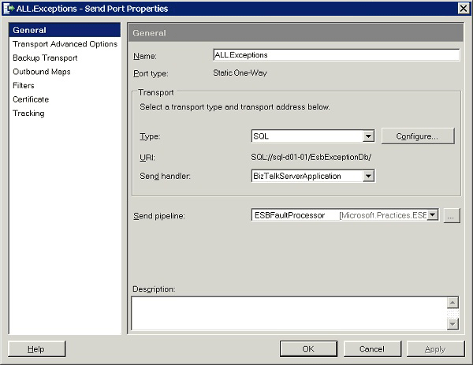
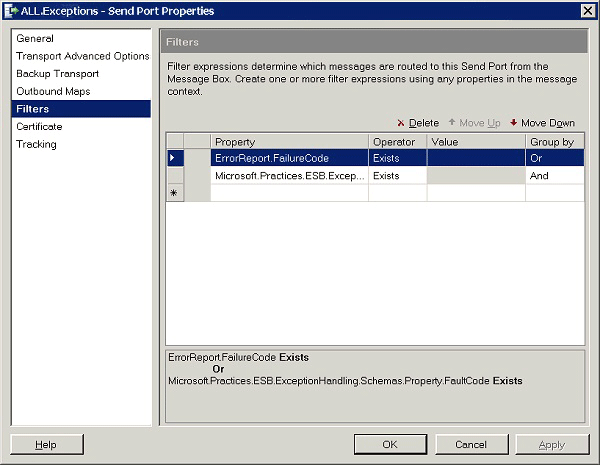

# The ESB Fault Processor Pipeline
The [!INCLUDE[esbToolkit](../includes/esbtoolkit-md.md)] installs a send port named ALL.Exceptions that uses the ESBFaultProcessor send pipeline. Figure 1 shows the properties of the ALL.Exceptions send port.  
  
   
  
 **Figure 1**  
  
 **The configuration of the ALL.Exceptions send port, including its use of the ESBFaultProcessor pipeline**  
  
 The ESBFaultProcessor pipeline contains the following pipeline components: ESB Exception Encoder, ESB Business Activity Monitoring (BAM) Tracker, and ESB Transform.  
  
 The ALL.Exceptions send port subscribes to all ESB fault messages and to all messages generated by the BizTalk Failed Message Routing mechanism. Figure 2 shows the filter property settings of the ALL.Exceptions send port.  
  
   
  
 **Figure 2**  
  
 **The filter property of the ALL.Exceptions send port defines the port subscription**  
  
## The Fault Processor Pipeline Exception Encoder Component  
 The ESB Exception Encoder pipeline component normalizes fault messages generated in the ESB Failed Orchestration Exception Routing mechanism and the BizTalk Failed Message Routing mechanism into canonical messages that comply with the ESB Exception Reporting schema.  
  
 For a Failed Orchestration Exception Routing exception, the component enriches and serializes all fault message properties, XLANG messages, context properties, and **System.Exception** information into an XML message.  
  
 For a Failed Message Routing exception, the component enriches the data by adding the application name and other ambient properties, and it applies the schema namespace to the outbound XML message content.  
  
 Optionally, the ESB Exception Encoder pipeline component can also apply Microsoft InfoPath processing instructions to the outbound message. You can modify the InfoPath instructions by setting the properties of the pipeline component in design view. The following three design time properties affect the run-time behavior of the ESB Exception Encoder pipeline component:  
  
- **EscapeCDATA.** This property determines whether the component will escape any **CDATA** sections found in persisted messages so that InfoPath can display them correctly.  
  
- **FaultDocumentNamespace.** This property has a default value of **http://schemas.microsoft.biztalk.practices.esb.com/exceptionhandling**. This can be modified to use a custom outbound namespace for the persisted messages.  
  
- **ProcessingInstruction.** This property can contain any InfoPath processing instruction that complies with the ESB Exception Reporting fault schema. The [!INCLUDE[esbToolkit](../includes/esbtoolkit-md.md)] includes an InfoPath template that conforms to the following processing instruction.  
  
  ```  
  <?mso-infoPathSolution solutionVersion="1.0.0.346" productVersion="11.0.6565"  
  PIVersion="1.0.0.0"   
  href=file:///\\localhost\publish\Microsoft.Practices.ESB.ExceptionHandling.InfoPath.Reporting.xsn  
  name="urn:schemas-microsoft-com:office:infopath:  
  Microsoft-Practices-ESB-ExceptionHandling-InfoPath-Reporting:  
  http---schemas-microsoft-biztalk-practices-esb-com-exceptionhandling"  
  language="en-us" ?><?mso-application progid="InfoPath.Document"?>  
  ```  
  
## The Fault Processor Pipeline BAM Tracker Component  
 The ESB BAM Tracker pipeline component receives the message from the ESB Exception Encoder component and writes selected fault data to the BAM primary import tables created during the installation of the ESB Exception Management Framework.  
  
 The ESB BAM Tracker component uses the **GetEventStream** method of the pipeline context to add the following fields as an activity record to the BAM Primary Import database:  
  
- **Application**  
  
- **Description**  
  
- **FaultSeverity**  
  
- **ServiceName**  
  
- **ErrorType**  
  
- **FaultCode**  
  
- **MachineName**  
  
- **MessageID**  
  
- **DateTime**  
  
- **FaultDescription**  
  
- **Scope**  
  
- **FailureCategory**  
  
- **FaultGenerator**  
  
- **ServiceInstanceID**  
  
  The ESB BAM Tracker component uses the message identifier (the **MessageID** property) value of the ESB fault message as the BAM activity ID. The ESB BAM Tracker component exposes two design time properties that you can set to change its run-time behavior:  
  
- **Enabled.** This property determines whether the component will process the message and write it to the BAM database. When set to **False**, the component just sends the message to the next component in the pipeline.  
  
- **FaultDocumentNamespace.** This property has a default value of **http://schemas.microsoft.biztalk.practices.esb.com/exceptionhandling**.  
  
## The Fault Processor Pipeline Transform Component  
 The ESB Fault Processor pipeline uses the ESB Transform pipeline component to execute a BizTalk map that translates the encoded ESB fault message into a format that matches the schema for the BizTalk SQL Adapter (ExceptionSql.xsd). The component then passes the transformed message to the SQL Adapter, which inserts the ESB fault message into the ESB Management Portal database.  
  
 The ESB Transform pipeline component exposes three design-time properties that can be modified to change its run-time behavior:  
  
- **Enabled.** This property enables or disables the component.  
  
- **Validate.** This property specifies whether a message needs to be validated.  
  
- **MapName.** This property contains the name of the map that must be executed to translate the message for storage in the ESB Management Portal database. The following is the default value.  
  
  ```  
  Microsoft.Practices.ESB.ExceptionHandling.Maps.FaultMessage_to_ExceptionSql,  
  Microsoft.Practices.ESB.ExceptionHandling.Maps,  
  Version=2.0.0.0,  
  Culture=neutral,  
  PublicKeyToken=c2c8b2b87f54180a  
  ```  
  
  After all the pipeline components finish executing, the BizTalk SQL Server database adapter inserts the fault message into the ESB Management Portal database.