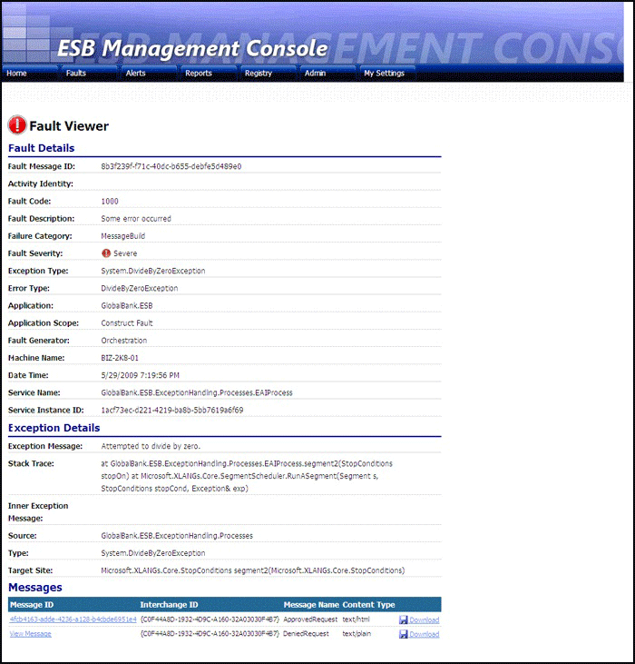
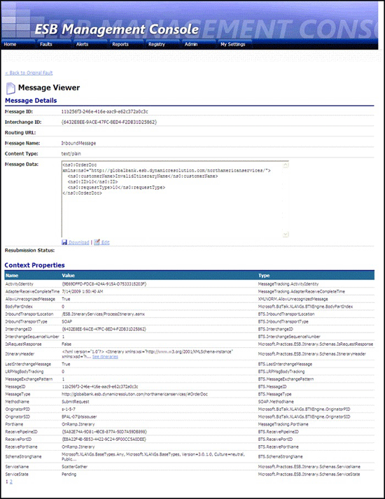

# The ESB Management Portal and Fault Message Viewer
A major component of the [!INCLUDE[esbToolkit](../includes/esbtoolkit-md.md)] is a Web-based portal that provides a wide range of exception management and alert notification features; in addition, it acts as a useful configuration management and Universal Description, Discovery, and Integration (UDDI) registration interface. Figure 1 shows the home page of the portal, which provides an overview of the health of the currently running applications.  
  
   
  
 **Figure 1**  
  
 **The home page of the ESB Management Portal**  
  
 Users can select a fault message displayed in the ESB Management Portal to view the ambient and static properties of the fault and a list of the original messages contained in the fault message, as shown in Figure 2.  
  
   
  
 **Figure 2**  
  
 **The ESB Fault Viewer page of the ESB Management Portal**  
  
 ESB Fault messages displayed in the ESB Management Portal may be the result of an error in the values of the original message when submitted for processing. The [!INCLUDE[esbToolkit](../includes/esbtoolkit-md.md)] supports "repair and resubmit" functionality, which allows administrators or users to edit failed messages and to submit them to an on-ramp for processing.  
  
 Selecting one of the contained messages opens the Message View page in Message Details view, as shown in Figure 3. In this view, users can see the message content, download the message, or click **Edit** to switch to Edit view, where they can repair and resubmit the message.  
  
   
  
 **Figure 3**  
  
 **The ESB Message Viewer showing the Fault Details view**  
  
 For a complete description and usage options of the ESB Management Portal, including the Fault Viewer, the message resubmission process, and the techniques used for listing, sorting, and analyzing faults, see [Administration with the BizTalk ESB Toolkit](../esb-toolkit/administration-with-the-biztalk-esb-toolkit.md).
