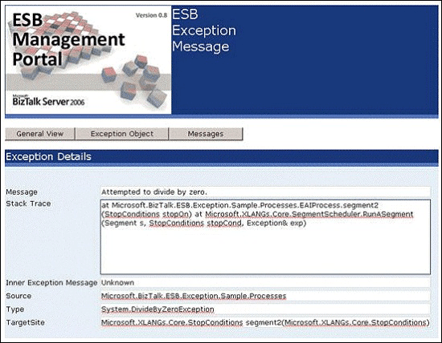
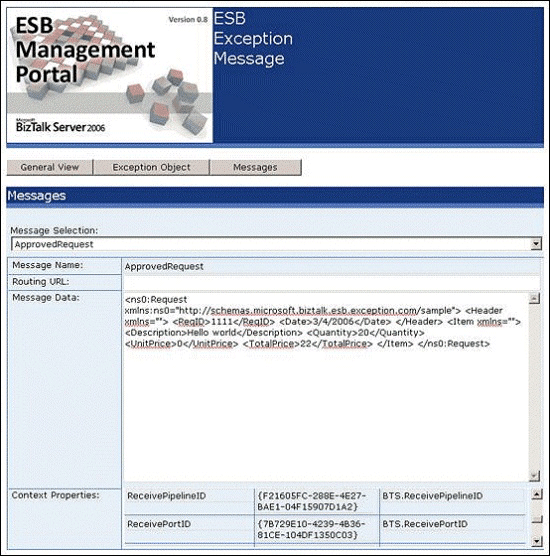

# The InfoPath Message Template
As an alternative to viewing ESB fault messages in the ESB Management Portal, users can take advantage of a Microsoft InfoPath message template named the ESB Exception Message Viewer, provided with the [!INCLUDE[esbToolkit](../includes/esbtoolkit-md.md)].  
  
 The ESB Exception Management Framework can persist messages in a serialized format that, together with the ESB Exception Message Viewer template, will display several views of the fault message and the original messages it contains. The ESB Exception Message Viewer provides the following views:  
  
- General view  
  
- Exception Object view  
  
- Messages view  
  
  Figure 1 shows the General view of the ESB Exception Message Viewer, which displays most ambient properties of the exception.  
  
    
  
  **Figure 1**  
  
  **The ESB Exception Message Viewer showing the General view**  
  
  Figure 2 shows the Exception Object view, which displays the properties and the stack trace from the **System.Exception** object.  
  
    
  
  **Figure 2**  
  
  **The ESB Exception Message Viewer showing the Exception Object view**  
  
  Figure 3 shows the Messages view, which provides a drop-down list from which the user can select from available persisted messages. The view displays the values of the context properties of the persisted message and the XML message content.  
  
    
  
  **Figure 3**  
  
  **The ESB Exception Message Viewer showing the Messages view**