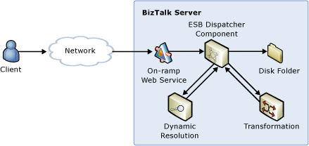

# Transforming and Routing a Message to Disk Folder, Queue, or FTP Folder
In this use case, the ESB transforms a message submitted through the Itinerary Web service or any on-ramp. A dynamic resolution lookup of type FILE, FTP, or queue location determines the map name (for transformation) and the target endpoint for the message, as illustrated in Figure 1.  
  
   
  
 **Figure 1**  
  
 **Transforming and routing a message to a disk folder**  
  
 The Dynamic Resolution sample included with [!INCLUDE[esbToolkit](../includes/esbtoolkit-md.md)] demonstrates this use case. It shows how to use the components to dynamically resolve endpoint location, set routing properties, and resolve and execute BizTalk Server maps at the messaging level, without using an orchestration. It also demonstrates both one-way and two-way messaging patterns.  
  
 An extension of this use case is a simple routing solution that routes an incoming message to a file, FTP, or queue location without the additional step of transformation.  
  
 For more information, see [Installing and Running the Dynamic Resolution Sample](../esb-toolkit/installing-and-running-the-dynamic-resolution-sample.md).
