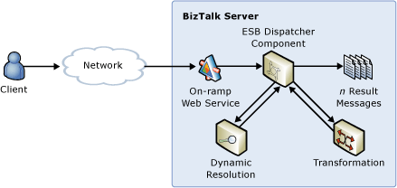

# Transforming and Routing a Message to Multiple Endpoints
In this use case, the ESB performs a transformation on a message submitted through the Itinerary Web service on-ramp. A dynamic resolution lookup determines the map name and transforms the inbound message. Additionally, the itinerary specifies n number of target endpoints that the Itinerary service will dynamically resolve and to which it will route the transformed message. All operations occur at the messaging layer, as illustrated in Figure 1.  
  
   
  
 **Figure 1**  
  
 **Transforming and routing a message to multiple endpoints**  
  
 The Dynamic Resolution sample included with the [!INCLUDE[esbToolkit](../includes/esbtoolkit-md.md)] demonstrates this use case. It shows how to use ESB pipeline components, specifically the ESB Dispatch Disassembler component, to dynamically resolve endpoint location, set routing properties, and resolve and execute BizTalk Server maps at the messaging level, without using an orchestration. It also demonstrates both one-way and two-way messaging patterns.  
  
 For more information, see [Installing and Running the Dynamic Resolution Sample](../esb-toolkit/installing-and-running-the-dynamic-resolution-sample.md) and [Installing and Running the Multiple Web Services Sample](../esb-toolkit/installing-and-running-the-multiple-web-services-sample.md).
