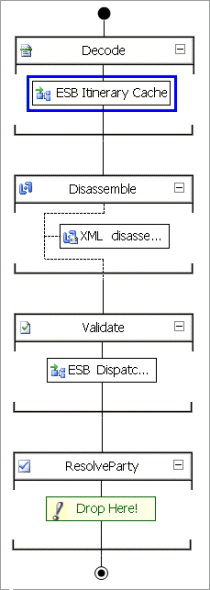

# Using a Pipeline Component to Cache an Itinerary for Solicit-Response
Messages submitted through a [!INCLUDE[esbToolkit](../includes/esbtoolkit-md.md)] itinerary on-ramp can go through either a one-way itinerary or a two-way (request-response) itinerary. To support request-response itineraries, the itinerary mechanism must provide caching for BizTalk dynamic Solicit-Response send ports.  
  
 The ESB Itinerary Cache pipeline component places the itinerary stored in the outbound message context into the cache and attaches it to the response message; it is returned by the send port using the configurable caching key. This allows the itinerary service to process and execute subsequent services defined after the current service in the itinerary.  
  
 By default, the ESB Itinerary Cache pipeline component resides in the ItineraryReceiveSend BizTalk pipeline, as shown in Figure 1. This pipeline should be used only as the receive pipeline for a Solicit-Response send port.  
  
   
  
 **Figure 1**  
  
 **The ESB Itinerary Cache Pipeline component**  
  
 Use the ESB Itinerary Cache Pipeline component in a BizTalk receive pipeline for a Solicit-Response send port.
