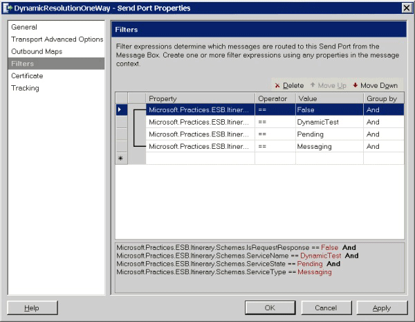

# Using a Send Port as an Itinerary Service Subscriber
As an example of how to use a send port as an itinerary service subscriber, Figure 1 shows the filter conditions for a dynamic one-way sent port that picks up messages that meet the following conditions:  
  
- **IsRequestResponse = False**  
  
- **ServiceName = DynamicTest**  
  
- **ServiceState = Pending**  
  
- **ServiceType = Messaging**  
  
    
  
  **Figure 1**  
  
  **Example of send port filters**  
  
  Use send port filter expressions to specify the property and value sets of messages it will pick up from the Message Box database through the itinerary on-ramp.  
  
> [!NOTE]
>  It is important to use filter conditions that are as specific and focused as possible; otherwise, there is a risk of picking up unintended messages, which could cause problems in a high-volume environment. The schema System-Properties.xsd defines the filter properties of subscriptions.