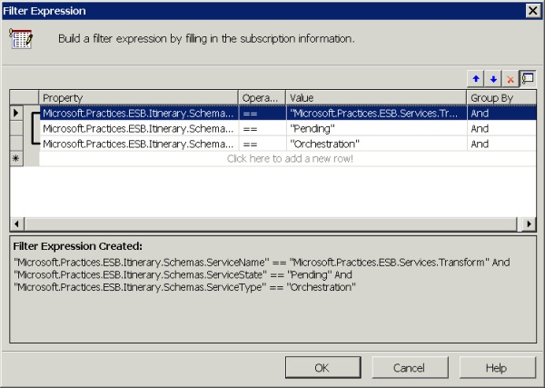

# Using an Orchestration as an Itinerary Service Subscriber
Orchestrations can also act as itinerary services. To participate in an itinerary, you must first design the orchestration as direct-bound; to do this, use a filter subscription similar to that of the send port in the previous topic, [Using a Send Port as an Itinerary Service Subscriber](../esb-toolkit/using-a-send-port-as-an-itinerary-service-subscriber.md). Figure 1 shows an example of a filter expression for a suitable orchestration to pick up any message that meets the following conditions:  

- **ServiceName = Microsoft.Practices.ESB.Services.Transform**  

- **ServiceState = Pending**  

- **ServiceType = Orchestration**  

    

  **Figure 1**  

  **Example filter expression for an orchestration that will participate in an itinerary as a subscriber**  

  When messages arrive in Microsoft BizTalk Server through an ESB on-ramp, the validation step in the ESB pipeline writes the property values for the filter properties into the BizTalk context properties of the incoming message; this promotes them to the message context. The itinerary service always sets the **ServiceName** property for the currently active service to the name of the service to process next, and with a **ServiceState** property value of **Pending**. For a subscription, you must set at least the first three of the following properties:  

- **ServiceName.** This is the name of the service, as stored in the ESB itinerary, and can be any name. The itinerary uses this name to identify which service to execute.  

- **ServiceState.** This is the state of the current itinerary service step to execute. The current service step (for processing next) will always have the value **Pending**, set by either the ESB itinerary pipeline component, the ESB Itinerary Selector pipeline component, or code that calls the **Advance** method of the itinerary API.  

- **ServiceType.** This property defines the type of service, indicating whether it originates from the orchestration or the messaging subsystem in BizTalk.  

- **IsRequestResponse.** This optional property must have the same value as the **IsRequestResponse** property of the service.
