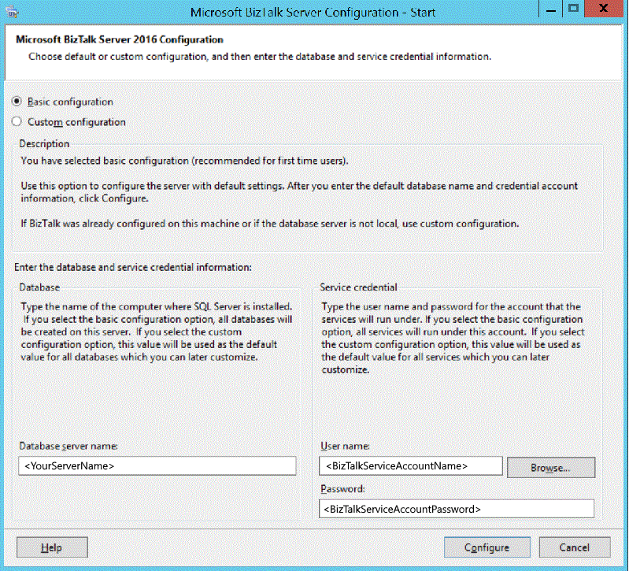

# Configure BizTalk Server
Configure [!INCLUDE[btsBizTalkServerNoVersion](../includes/btsbiztalkservernoversion-md.md)] using basic configuration or custom configuration.

## Basic configuration vs. Custom configuration

* If your configuration uses domain groups, do a Custom Configuration.
* If your configuration uses custom group names instead of the default group names, do a Custom Configuration.
* If your configuration uses custom database names instead of the default database names, do a Custom Configuration.
* If [!INCLUDE[btsBizTalkServerNoVersion](../includes/btsbiztalkservernoversion-md.md)] and SQL Server are on separate computers, domain groups are required. As a result, do a Custom Configuration.
* You cannot configure BAM Analysis on a SQL Server named instance using Basic Configuration. If you are using named instances and want to configure BAM Analysis, do a Custom Configuration.
* Basic Configuration is recommended for users setting up a complete installation of [!INCLUDE[btsBizTalkServerNoVersion](../includes/btsbiztalkservernoversion-md.md)] and SQL Server running on a single server.
* Basic Configuration is faster because it automatically creates the local groups and databases using the default names.

## Before you begin
* [!INCLUDE[btsBizTalkServerNoVersion](../includes/btsbiztalkservernoversion-md.md)] can be configured using SQL Server default instances and named instances. 
* The account you are logged on as must be a member of the local administrators group and have System Administrator (SA) rights on SQL Server.
* If you use Domain Groups, the Domain Groups must exist *before* configuring [!INCLUDE[btsBizTalkServerNoVersion](../includes/btsbiztalkservernoversion-md.md)].
* The default accounts generated by [!INCLUDE[btsBizTalkServerNoVersion](../includes/btsbiztalkservernoversion-md.md)] and listed in the [!INCLUDE[btsBizTalkServerNoVersion](../includes/btsbiztalkservernoversion-md.md)] Configuration are local groups. In a multiserver environment, replace the local groups with domain groups.
* If you configure BAM Analysis Services, then the account you are logged on as must be a member of the OLAP Administrators group on the OLAP computer.

## Basic Configuration

1. In the start menu, right-select **BizTalk Server Configuration**, and then select **Run as Administrator**. This opens the configuration wizard. 
2. Select the following options: 
    1. Select **Basic configuration**.
    2. The **Database server name** automatically defaults to the local computer name.   
    3. Enter the **User name** and **Password** for the account that the BizTalk services will run as. As a best practice, create a unique account. Do not use your personal username.  
          
    If you enter a user name with administrative credentials on this computer, you receive a warning. This is normal. Select **OK** to continue.

3. Select **Configure**.
4. Review your configuration details, and select **Next**.
5. When the configuration wizard completes, select **Finish**.

A configuration log file is generated in a temp folder, similar to: `
C:\Users\username\AppData\Local\Temp\ConfigLog(01-12-2017 0h37m59s).log`.

When you do a basic configuration, the following occurs:

- All database names are generated automatically by [!INCLUDE[btsBizTalkServerNoVersion](../includes/btsbiztalkservernoversion-md.md)].
- All applicable database logon information is run under the account you enter. 
- All BizTalk services are generated automatically by [!INCLUDE[btsBizTalkServerNoVersion](../includes/btsbiztalkservernoversion-md.md)].
- All BizTalk services run under the account you enter. The configuration process grants this account the necessary security permissions on the server and objects in SQL Server.
- All features are configured based on the prerequisite software you installed on the computer.
- Groups are automatically created local to the computer using the default group names.
- The Default Web Site in Internet Information Services (IIS) is used for any feature that requires IIS.

## Custom Configuration

1. In the start menu, right-select **BizTalk Server Configuration**, and then select **Run as Administrator**. This opens the configuration wizard.
2. Select **Custom configuration**, and select **Configure**.

### Configure Enterprise Single Sign-on (SSO)

* When SSO is configured, it cannot be reconfigured using BizTalk Server Configuration. To reconfigure SSO, use BizTalk Server Administration.
* When configuring the SSO Windows accounts using local accounts, enter only the account name. Do not enter the computer name.
* When using a local SQL Server named instance as data store, use `LocalMachineName\InstanceName`. Do not use `LocalMachineName\InstanceName, PortNumber`. 

1. Select **Enterprise SSO**.
2. Configure the following:

   |                     Use this                      |                                                                                                                                                                                                                                                                                                                           To do this                                                                                                                                                                                                                                                                                                                            |
   |---------------------------------------------------|-----------------------------------------------------------------------------------------------------------------------------------------------------------------------------------------------------------------------------------------------------------------------------------------------------------------------------------------------------------------------------------------------------------------------------------------------------------------------------------------------------------------------------------------------------------------------------------------------------------------------------------------------------------------|
   | Enable Enterprise Single Sign-On on this computer |                                                                                                                                                                                                                                                                                                            Configure this server with SSO settings.                                                                                                                                                                                                                                                                                                             |
   |              Create a new SSO system              | If this is the first SSO server you are configuring, select this option. This creates and configures the SSO database, creates the master secret (an encrypted security key), and installs the services used by SSO. You must also back up the secret on this secret server.  Key details:  <ul><li>It is recommended to configure the master secret server as a stand-alone server.</li><li>You must be an SSO administrator while performing this configuration task.</li><li>Only one master secret server can be associated with one BizTalk group. Associating two master secret servers to the same BizTalk group is not supported.</li></ul> |
   |            Join an existing SSO system            |                                                                                                                          If you are adding a [!INCLUDE[btsBizTalkServerNoVersion](../includes/btsbiztalkservernoversion-md.md)] to an existing group, then select this option. The [!INCLUDE[btsBizTalkServerNoVersion](../includes/btsbiztalkservernoversion-md.md)] shares the same SSO configuration and databases with the other [!INCLUDE[btsBizTalkServerNoVersion](../includes/btsbiztalkservernoversion-md.md)]s in the group.                                                                                                                          |
   |                    Data stores                    |                                                                                                                                                                                                                                   Enter the server name of your SSO server. If you are on the SSO server, then select the local server name. You can keep **SSODB** as the default database name, or enter something custom.                                                                                                                                                                                                                                    |
   |                  Windows service                  |                                                                                                                                                                                                                                                              Enter the account used to run the Enterprise Single Sign-On service. If SQL Server is on another computer, enter the domain account.                                                                                                                                                                                                                                                               |
   |                 Windows accounts                  |                                                                                                                                                                                                                                                                You can keep the default group names, or enter something custom. If SQL Server is on another computer, enter the domain accounts.                                                                                                                                                                                                                                                                |

3. Select **Enterprise SSO Secret Backup**. This option saves the master secret to an encrypted backup file. 
4. Configure the following:  

    |Use this|To do this|
    | --- | --- |
    |Secret backup password | Enter the master secret password.|
    |Confirm password|Re-enter the master secret password.|
    |Password reminder|Type a reminder for the password you enter. Seriously - don't skip this step. |
    |Backup file location|Lists the backup file name and location. By default, it is stored at \Program Files\Common Files\Enterprise Single Sign-On\ *FileName*.bak.|

**ALWAYS** backup the master secret, and share the password with another BizTalk Administrator.

### Configure Groups

* When using a local SQL Server named instance as data store, use `LocalMachineName\InstanceName`. Do not use `LocalMachineName\InstanceName, PortNumber`.

1. Select **Group**.
2. Configure the following:

   |                       Use this                        |                                                                                                                                         To do this                                                                                                                                          |
   |-------------------------------------------------------|---------------------------------------------------------------------------------------------------------------------------------------------------------------------------------------------------------------------------------------------------------------------------------------------|
   |     Enable BizTalk Server Group on this computer      |                                                                                                 Select this option to create a new BizTalk group on this server, or join an existing group.                                                                                                 |
   |              Create a new BizTalk Group               |                                       If this is the first [!INCLUDE[btsBizTalkServerNoVersion](../includes/btsbiztalkservernoversion-md.md)] in the group, then select this option. You use this option to create the databases, and add the groups.                                       |
   |            Join an existing BizTalk Group             |                                                                    If you are joining this [!INCLUDE[btsBizTalkServerNoVersion](../includes/btsbiztalkservernoversion-md.md)] to an existing group, select this option.                                                                     |
   | Create an Analysis database for tracking aggregations |                                                                                  Select this option to install SQL Server Analysis Services, and you want to track and store health monitoring OLAP cubes.                                                                                  |
   |                      Data Stores                      | Enter the server name that hosts your BizTalk databases. If this server has BizTalk and SQL both installed, then enter the local server name. If SQL Server is on another computer, enter the SQL Server name.  You can keep the default database names, or enter something custom. |
   |             BizTalk Administrative Roles              |                                                                              You can keep the default group names, or enter something custom. If SQL Server is on another computer, enter the domain accounts.                                                                              |

### Configure the BizTalk Runtime

* Once the Runtime is configured, it cannot be reconfigured using [!INCLUDE[btsBizTalkServerNoVersion](../includes/btsbiztalkservernoversion-md.md)] Configuration. To reconfigure the Runtime, use [!INCLUDE[btsBizTalkServerNoVersion](../includes/btsbiztalkservernoversion-md.md)] Administration.
* The first host you create in the group must be an In-Process host and host instance.
* When you configure the Runtime on multiple [!INCLUDE[btsBizTalkServerNoVersion](../includes/btsbiztalkservernoversion-md.md)]s in the same group, the same service account cannot be used for both the trusted and untrusted host applications. You must use a unique account for the trusted application, and for the untrusted application. 

1. Select **BizTalk Runtime**.
2. Configure the following:

   |                                                      Use this                                                      |                                                                                                                                                                                                                                                                                                                                                                                                                 To do this                                                                                                                                                                                                                                                                                                                                                                                                                  |
   |--------------------------------------------------------------------------------------------------------------------|---------------------------------------------------------------------------------------------------------------------------------------------------------------------------------------------------------------------------------------------------------------------------------------------------------------------------------------------------------------------------------------------------------------------------------------------------------------------------------------------------------------------------------------------------------------------------------------------------------------------------------------------------------------------------------------------------------------------------------------------------------------------------------------------------------------------------------------------|
   | Register the [!INCLUDE[btsBizTalkServerNoVersion](../includes/btsbiztalkservernoversion-md.md)] runtime components |                                                                                                                                                                                                                                                                                                                                            Select this option to create the hosts and host instances on this [!INCLUDE[btsBizTalkServerNoVersion](../includes/btsbiztalkservernoversion-md.md)].                                                                                                                                                                                                                                                                                                                                            |
   |                                        Create In-Process Host and Instance                                         | Creates the BizTalkServerApplication host and instance on this computer.  Additional options: <ul><li>**Trusted**: Passes the credentials (SSID and/or Party ID) of the sender when submitting messages to the MessageBox database. This is equivalent to creating a trust relationship between the servers. Most hosts and instances are not trusted.</li><li>**32-bit only**: Some adapters only run in a 32-bit process but most are 64-bit compliant. This setting can be enabled/disabled in BizTalk Administration after you configure BizTalk. So, don't stress about it.</li><li>**Host name**: BizTalkServerApplication is the default. If/when you create new hosts and instances in BizTalk Administration, you can be specific with your names, such as TrackingHost, or ReceivingHost. So, leave this as-is.</li></ul> |
   |                                         Create Isolated Host and Instance                                          |                                                                         The isolated host runs within IIS. In many environments, it's best to keep the default values.  Additional options: <ul><li>**Trusted**: Passes the credentials (SSID and/or Party ID) of the sender when submitting messages to the MessageBox database. This is equivalent to creating a trust relationship between the servers. Most hosts and instances are not trusted.</li><li>**32-bit only**: Some adapters only run in a 32-bit process but most are 64-bit compliant. This setting can be enabled/disabled in BizTalk Administration after you configure BizTalk.</li><li>**Isolated Host name**: BizTalkServerIsolatedHost is the default. Leave this as-is. </li></ul>                                                                          |
   |                                                  Windows service                                                   |                                                                                                                                                                                                                                                                                                                                                             Enter the accounts used to run the host instances. If SQL Server is on another computer, enter the domain accounts.                                                                                                                                                                                                                                                                                                                                                             |
   |                                                   Windows Groups                                                   |                                                                                                                                                                                                                                                                                                                                                      You can keep the default group names, or enter something custom. If SQL Server is on another computer, enter the domain accounts.                                                                                                                                                                                                                                                                                                                                                      |

### Configure Business Rules Engine (BRE)

If you don't use BRE, then skip this section.

- We recommend that you configure a [!INCLUDE[btsBizTalkServerNoVersion](../includes/btsbiztalkservernoversion-md.md)] group before you configure the Business Rule Engine. If you configure BRE before configuring a [!INCLUDE[btsBizTalkServerNoVersion](../includes/btsbiztalkservernoversion-md.md)] group, the [!INCLUDE[btsBizTalkServerNoVersion](../includes/btsbiztalkservernoversion-md.md)] configuration does not add group-related administrative roles to the Rule Engine database.

1. Select **Business Rules Engine**.
2. Configure the following:

   |                   Use this                    |                                                                                                                                       To do this                                                                                                                                        |
   |-----------------------------------------------|-----------------------------------------------------------------------------------------------------------------------------------------------------------------------------------------------------------------------------------------------------------------------------------------|
   | Enable Business Rules Engine on this computer |                                                                           If you use BRE on this [!INCLUDE[btsBizTalkServerNoVersion](../includes/btsbiztalkservernoversion-md.md)], then select this option.                                                                           |
   |                  Data Stores                  | Enter the server name that hosts your Rules database. If this server has BizTalk and SQL both installed, then enter the local server name. If SQL Server is on another computer, enter the SQL Server name.  You can keep the default database name, or enter something custom. |
   |                Windows service                |                                                                                 Enter the accounts used to run the Rule Update Service. If SQL Server is on another computer, enter the domain account.                                                                                 |

### Configure BAM Tools

If you don't use BAM Tools, then skip this section.

The Business Activity Monitoring Tools include:

- BAM add-in for Excel
- BAM Manager
- BAM Portal

- Configuring BAM tools requires certain SQL Server administrative functionality and must be performed from a machine that has Integration Services installed .
- The BAM tools may be used by multiple BizTalk groups. When you unconfigure the BAM tools, the connection to the BizTalk group is removed. However, the BAM SQL Server infrastructure continues to work for other BizTalk groups pointing to the BAM Primary Import tables.
- You use the Business Activity Monitoring Tools page to reconfigure the BAM database on-the-fly. For example, configure the BAM database again without removing the existing configuration. Reconfiguring these BAM databases breaks any already-deployed OLAP views and any alerts. If you have existing views and alerts that you want to keep in the newly-configured databases, then do one of the following:  
    - Undeploy the alerts and views before reconfiguring, and then redeploy them after reconfiguring. Any data that has been archived is not present in the views.
    - If you are not using BAM Alerts, then back up the databases before you reconfigure. After reconfiguring, restore the databases to the newly configured location.
- If you are consolidating [!INCLUDE[btsBizTalkServerNoVersion](../includes/btsbiztalkservernoversion-md.md)] databases, you should exclude the BAM Archive, and BAM Analysis databases.

1. Select **BAM Tools**.
2. Configure the following:

    |Use this|To do this|
    | --- | --- |
    |Enable Business Activity Monitoring tools | Enable and install BAM tools on this computer. |
    | Enable Analysis Services for BAM aggregations | Provides tracking information for BAM alerts.|
    |Data Stores| Enter the server name that hosts your BAM databases. If this server has BizTalk and SQL both installed, then enter the local server name. If SQL Server is on another computer, enter the SQL Server name.  You can keep the default database name, or enter something custom.|
    |Remove the Business Activity/Monitoring tools for this BizTalk Group | Uninstalls and removes the BAM tools from the BizTalk Group. |

   ### Configure BAM Alerts 

BAM alerts require BAM tools to be enabled.

1. Select **BAM Alerts**.
2. Configure the following:

    |Use this|To do this|
    | --- | --- |
    | Enable BAM alerts | If you use BAM alerts, then check this option.   Remember, you must have already configured SQL Database Mail to use BAM Alerts. |
    | Windows service | Enter the accounts used to run the BAM Alerts service. If SQL Server is on another computer, enter the domain account. |
    | BAM Alerts SMTP Server| Enter the SMTP Server name that you configured with SQL Database Mail. |
    | BAM Alerts File Location| Enter a network share to store the BAM alerts.   **Note**  You must manually create this share before BAM alerts can store the files.|
    | SQL Server for Alerts Databases | Enter the SQL Server name that hosts the Alerts database.  **Note**  Use of IPv6 addresses to specify the NS SQL Server for the Alerts Database is not supported. You can, however, use a computer name and the DNS translation will handle the lookup.|
    |Prefix for Alerts Database Names| Enter a prefix used for the Alerts databases.|  

### Configure the BAM Portal

1. Select **BAM Portal**.
2. Configure the following:

    |Use this|To do this|
    | --- | --- |
    |Enable the BAM Portal | If you use the BAM Portal, then thick this option. | 
    |Web service accounts | Enter the accounts used to run the IIS services. If SQL Server is on another computer, enter the domain accounts.|
    |Windows groups | You can keep the default group name, or enter something custom. If SQL Server is on another computer, enter the domain account.|
    |BAM Portal Web Site|Select the Web site to host the BAM Portal. In some enviornments, the Default Web Site is the only website configured. |

### Configure BizTalk EDI/AS2 Runtime 

* Enterprise SSO, Group, and BizTalk Runtime must be configured before you configure BizTalk EDI/AS2 Runtime. 
* BAM Tools must be enabled before configuring the EDI/AS2 Runtime Status Reporting features.
* If you are only configuring EDI, then BAM is not required.

1. Select **BizTalk EDI/AS2 Runtime**.
2. Configure the following:

    |Use this|To do this|
    | --- | --- |
    |Enable BizTalk EDI/AS2 Runtime on this computer| If you will use X12, EDIFACT, or AS2 protocols for business-to-business messaging, then select this option. |
    |Enable BizTalk EDI for this BizTalk Group | Select if you use X12 or EDIFACT. |
    | Enable BizTalk AS2 for this BizTalk Group | Select if you use AS2. |
    | Enable BizTalk EDI/AS2 Runtime Status Reporting for this BizTalk Group | Enable the reporting user experience to provide the status of EDI interchanges and acknowledgments. |
    |Remove BizTalk EDI, AS2 and Status Reporting functionalities from this BizTalk Group | Uninstalls and removes the reporting feature from the group. |

### Configure Windows SharePoint Services web service - BizTalk Server 2013 and R2 only 

> [!IMPORTANT] 
> This section ONLY applies to BizTalk Server 2013 R2 and BizTalk Server 2013. If you're not using BizTalk Server 2013 R2 or BizTalk Server 2013, then skip this section.

* This SharePoint Services web service (SSOM) is removed starting with BizTalk Server 2016, and deprecated in BizTalk Server 2013 R2. It is replaced with the SharePoint Services Adapter (CSOM). The CSOM option is not displayed in the BizTalk configuration. The CSOM option is installed automatically with BizTalk, just as the File adapter, or the HTTP adapter is installed automatically.

1. Select **Windows SharePoint Services Adapter**.
2. Configure the following:

    |Use this|To do this|
    | --- | --- |
    | Enable Windows SharePoint Services Adapter on this computer | Select to install the SharePoint Services web service. An IIS web service is installed on the SharePoint Services computer, which can be on the same computer as BizTalk Server or a separate computer. In most environments, BizTalk Server and SharePoint Services are on separate computers.|
    |Windows group|You can keep the default group name, or enter something custom. |
    |Windows SharePoint Services Adapter Web site|Select the Web site that hosts the Windows SharePoint Service Adapter web service.|

### Apply your configuration

Select **Apply configuration**, and continue with the configuration. 

1. In **Summary**, review the components you selected, and select **Next**.
2. When complete, select **Finish**.

When finished, a configuration log file is generated in a temp folder, similar to: `
C:\Users\username\AppData\Local\Temp\ConfigLog(1-12-2017 2h39m30s).log`.

## IIS application pools and web sites
After you configure [!INCLUDE[btsBizTalkServerNoVersion](../includes/btsbiztalkservernoversion-md.md)], the following Internet Information Services (IIS) application pools and virtual applications may be created: 

### Application pools  

|Application Pool|Default Application Pool Identity|Description|  
|----------------------|---------------------------------------|-----------------|  
|BAMAppPool|*User-defined*|Application pool for the BAM Portal.|  
|BTSSharePointAdapterWSAppPool|*User-defined*|Application pool for the Windows SharePoint Service adapter Web service.|  
|STSWebServiceAppPool|*User-defined*|Application pool for the Trading Partner Management tools.|  
|TpmWSAppPool|*User-defined*|Application pool for the TPM Management Web service.|  

### Virtual applications  

|Virtual Application|Default Application Pool|Description|  
|-------------------------|------------------------------|-----------------|  
|BAM|BAMAppPool|Virtual application which hosts the BAM Portal components (pages, images, precompiled code, and other resources). This virtual application calls in to the BAMManagementService application to communicate with the BAM databases. **Note:**  To brand the BAM Portal, you can modify the contents of this application.|  
|BAMManagementService|BAMAppPool|Virtual application which hosts the BAMManagementService web service. This web service is used by the BAM Portal application to communicate with the BAM Primary Import Tables (PIT). The communication with the database is done using impersonated credentials stored in the registry which is created during configuration. Methods exposed by this web service can be used by custom clients to get views and their details, related activities, and pivot table layouts for any user. They can also be used to manage alerts in the database.|  
|BTSharePointAdapterWS|BTSSharePointAdapterWSAppPool|Virtual application which hosts the Windows SharePoint Service adapter Web service. Applies to BizTalk Server 2013 R2 and 2013 only.|  

## More configuration topics  

 [Configuring BizTalk Server on an Azure VM](http://msdn.microsoft.com/library/azure/jj248689.aspx)  

[Configuring BizTalk Server in a Cluster](../install-and-config-guides/configure-biztalk-server-in-a-cluster.md)

[Post-configuration steps to optimize your environment](../install-and-config-guides/post-configuration-steps-to-optimize-your-environment.md)

 [Securing Your BizTalk Server Deployment](../install-and-config-guides/securing-your-biztalk-server-deployment.md)  

