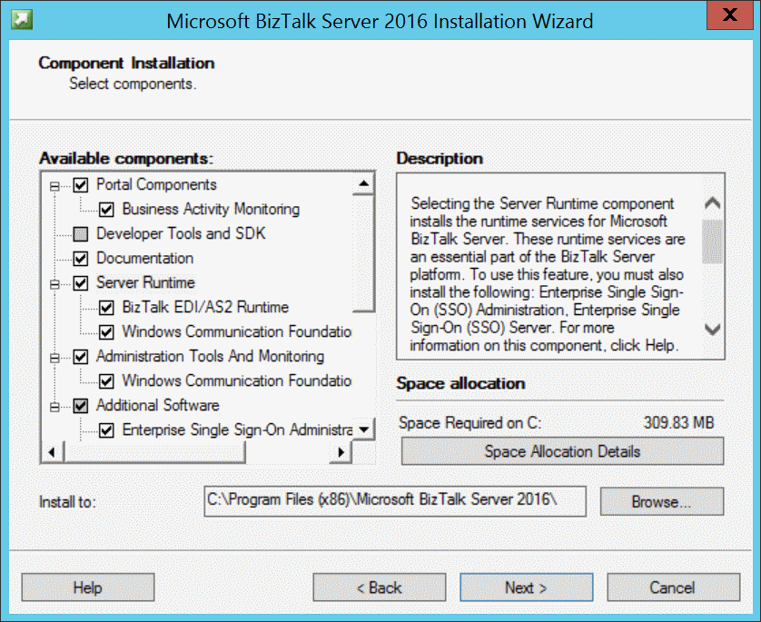
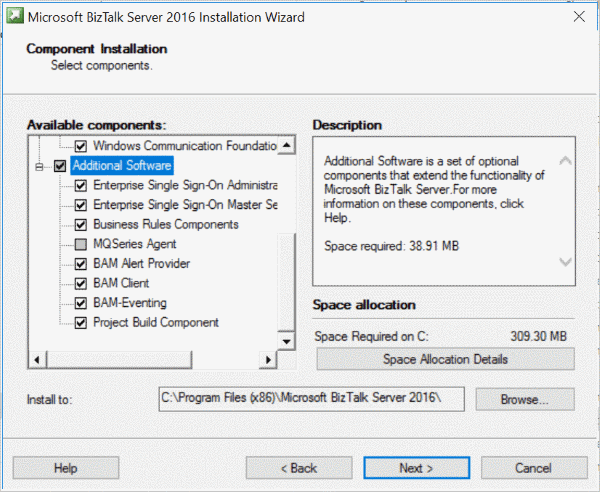

# Install BizTalk Server 2016
Install BizTalk Server on a single computer.

## Before you get started

* **System Administrator** – When you install SQL Server, setup automatically grants your signed-in account System Administrator rights. Since these rights are also required to install BizTalk Server, do one of the following:
  * Use the same account you used when you installed SQL Server.
  * Give the signed-in account System Administrator rights.
  * Confirm the signed-in account is a member of the local administrators group.
* **Account names** – Use the default account names whenever possible. The BizTalk Server setup automatically enters the default accounts. If there are multiple BizTalk Server groups within the Domain, change the account names to avoid conflicts. If you change the names, BizTalk Server supports only *NetBIOS domain name\user* for service accounts and Windows groups.
* **Account names with BAM Management Web Service** – BizTalk Server does not support built-in accounts or accounts without passwords for the BAM Management Web Service User. The web service accesses the BizTalk Server database and these accounts may suggest a security threat.

    > [!NOTE] 
    > Configuring BizTalk Server with these typs of accounts may succeed, but the BAM Management Web Service fails. Built-in accounts or accounts without passwords can be used for the BAM Application pool.

* **BizTalk Assembly Viewer** – Not supported on a 64-bit platform. 
* **Install and Uninstall** – Uninstalling BizTalk Server requires manually deleting the BizTalk Server databases. If you are installing BizTalk Server as a developer or evaluator, use a virtual machine. If you need to reinstall, you can easily roll back the virtual machine without having to uninstall and delete the databases.
* **32-bit and 64-bit computers** – There are few differences when installing BizTalk Server on 32-bit or 64-bit computer. The installation and configuration covers 32-bit and 64-bit computers. Any differences are noted.
* **Workgroups** - Installing and configuring BizTalk Server in the workgroup environment on a single computer is supported. SQL Server and BizTalk Server features and components are installed and configured on the same computer.

## Install BizTalk Server
1. Close any open programs. Run the BizTalk Server setup as an Administrator.
2. Select **Install Microsoft BizTalk Server 2016**.
3. Enter your **User name**, your **Organization**, and your product key. Select **Next**.
4. Accept the license agreement, and select **Next**.
5. Choose to participate in the Customer Experience Improvement Program, and select **Next**.
6. Choose which components you want to install:

    
  
    Be sure to select **Additional Software**. You can also change the installation location: 
  
    

    Select **Next**.   
  
   7. Depending on the components you choose, there may be some additional prerequisites, such as ADOMD.NET. The setup can install all the redistributable prerequisites automatically for you. Your options include:
7. **Manually install the redistributable prerequisites** : The installation wizard closes so you can manually install the missing prerequisites.
8. **Automatically install the redistributable prerequisites from the web** : Default. Requires internet access.
9. **Download the redistributable prerequisites CAB file** : Downloads a CAB file, which you can install later.
10. **Automatically install the redistributable prerequisites from a CAB file**: If you previously downloaded the CAB files, you can select this option to use those CAB files. 

    Select **Next**.
  
11. Review the summary page. To make any changes, select **Back** to check or uncheck any components. 

      To enable auto-logon after a system reboot, select **Set**, and enter the sign-in account. This is only enabled during the BizTalk setup. When setup is complete, this setting is disabled. 

     Select **Install**.
  
12. To configure BizTalk now, check **Launch BizTalk Server Configuration**. If you don't want to configure BizTalk now, then uncheck this option, and select **Finish** to close the installation wizard. 

A setup log file is generated in a temp folder, similar to: `C:\Users\*username*\AppData\Local\Setup(011217 xxxxxx).htm`
  
## Check the installation

* BizTalk Server is listed in **Programs and Features**.
* The `HKEY_LOCAL_MACHINE\SOFTWARE\Microsoft\BizTalk Server\3.0` registry key lists the BizTalk Server version, the install path, the edition, and other details.
* BizTalk Server Administration, Configuration, and other components are listed in your Apps. 

## Next step
[Configure BizTalk Server](../install-and-config-guides/configure-biztalk-server.md)