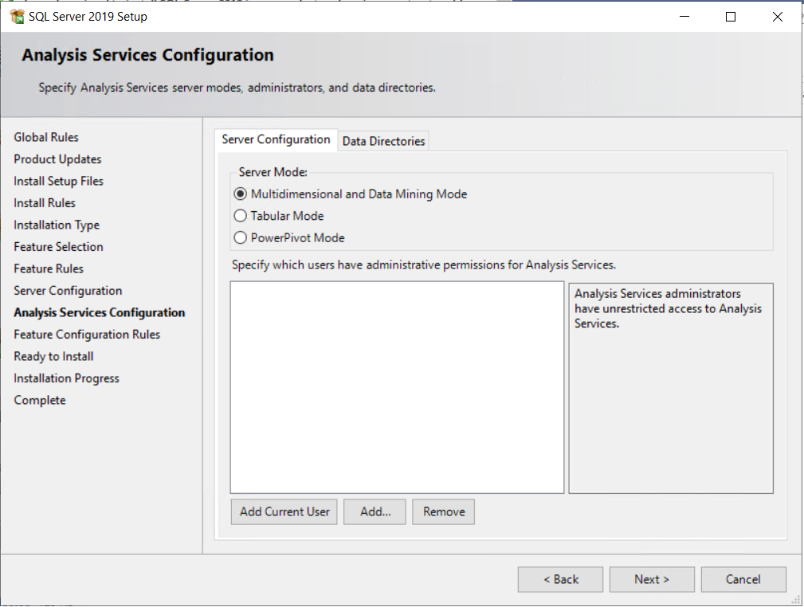

# Set up and install prerequisites for BizTalk Server 2020

Set up the server, and install and configure the software prerequisites.

## Join the Administrators Group

To install and configure BizTalk Server, sign in to the server using an administrator account on the local computer. Add any user accounts that are administering the BizTalk Server to the local Administrators group:

1. In the Start menu, open **Computer Management**.

    * Or, open **Administrative Tools**, and then select **Computer Management**.
    * Or, open **Server Manager**, select **Tools**, and then select **Computer Management**.
  
2. Expand **Local Users and Groups**, and select **Groups**.
3. Right-click the **Administrators** group, and select **Add to Group**. **Add** your accounts, and select **OK** to save your changes. 

## Change the computer name (optional)

If your computer name is longer than 15 characters, then BizTalk Server configuration fails. To change the computer name to less than 15 characters:

1. In **Server Manager** > **Dashboard**, select **Local Server**. 
2. In **Properties**, select the Computer name property to change it.
3. Restart the computer. 

**SEE ALSO** : Windows PowerShell [Rename-Computer](/powershell/module/microsoft.powershell.management/rename-computer)

## Enable Network DTC Access

If BizTalk and SQL Server are installed on separate computers, then enable Network DTC Access on the BizTalk Server and the SQL Server. 

1. In the Start menu, open "dcomcnfg".

    * Or, open **Administrative Tools**, and then select **Component Services**.
    * Or, open **Server Manager**, select **Tools**, and then select **Component Services**.
  
2. Expand **Component Services**, expand **Computers**, expand **My Computer**,  and expand **Distributed Transaction Coordinator**.
3. Right-click **Local DTC**, and select **Properties**.
4. Go to the **Security** tab, and check the following:  
    * Network DTC Access
    * Allow Inbound
    * Allow Outbound
    * No Authentication Required
5. Select **OK**. If prompted to restart MS DTC, select **Yes**. 

For additional settings that may be needed, see [Troubleshooting Problems with MSDTC](../core/troubleshooting-problems-with-msdtc.md).

## Configure Application Event Log (optional)

BizTalk Server setup keeps a record of events in the Application Event Log. Depending on the BizTalk Server features installed, the amount of space required in the log may exceed its limit. If the application event log runs out of space during the setup, the installation fails. Changing the Application Event Log settings prevents this failure.

1. In the Start menu, open **Event Viewer**:

    * Or, open **Administrative Tools**, and then select **Event Viewer**.
    * Or, open **Server Manager**, select **Tools**, and then select **Event Viewer**.
  
2. Expand **Windows Logs**, right-click **Application**, and then select **Properties**. 
3. To determine the available space, compare the **Log Size** and the **Maximum log size** properties. 

    * To add space, enter a higher number in **Maximum log size**.
    * To enable overwriting of old events when the log becomes full, select **Overwrite events as needed**.
    * To clear the log events, select **Clear log**.

4. Select **OK**.

## Install Windows Updates

Be sure to install the latest critical Windows updates. 

1. On the Start menu, open **Windows Updates**, and check for updates. You can also open **Settings**, and select **Update and security**.
2. After installing updates, you may need to restart the computer.

## Install Visual C++ 2015-2019 redistributable package

Download and install the [Visual C++ 2015-2019 redistributable package - x86](https://aka.ms/vs/16/release/VC_redist.x86.exe) and [Visual C++ 2015-2019 redistributable package - x64](https://aka.ms/vs/16/release/VC_redist.x64.exe).

The [Visual C++ downloads](https://support.microsoft.com/help/2977003/the-latest-supported-visual-c-downloads) lists all the available versions.

## Install Microsoft OLE DB Driver for SQL Server

Download and install the [Microsoft OLE DB Driver for SQL Server](/sql/connect/oledb/oledb-driver-for-sql-server).

## Enable IIS

BizTalk Server requires IIS for the following features:

- HTTP adapter
- SOAP adapter
- Windows SharePoint Services adapter
- Secure Sockets Layer (SSL) encryption
- Management REST API
- BAM Portal
- EDI

IIS is included with the operating system as a **Role** or a **Feature**, depending on the OS. To install:

1. In the Start menu, open **Turn Windows Features on or off**. Or, open **Server Manager**, select **Manage**, and then select **Add roles and features**.
2. Select **Internet Information Services** or **Web Server (IIS)**. In addition to the default checked options, also select the following: 

    **Windows 10**
   - In **Web Management Tools**, also check:  
       - IIS 6 Management Compatibility
       - IIS 6 Management Console
       - IIS 6 Scripting Tools (Installs adsutil.vbs)
       - IIS Metabase and IIS 6 configuration compatibility
       - IIS Management Console
   - In **World Wide Web Services**, expand **Security** and also check:
       - Basic Authentication
       - Windows Authentication    

     **Windows Server**
   - In **Security**, also check: 
       - Basic Authentication
       - Windows Authentication    
   - In **Management Tools**, also check:  
       - IIS Management Console
       - IIS 6 Management Compatibility
       - IIS 6 Metabase compatibility
       - IIS 6 Management Console
       - IIS 6 Scripting Tools (Installs adsutil.vbs)

3. Continue with the installation, and restart the computer if prompted. 

## Run 64-bit BAM portal (optional)

If you don't use the BAM portal, then you can skip this section. 

The BAM Portal runs in 32-bit mode. If you are using Internet Information Services (IIS) in a 64-bit environment, then set the application pool to run in 32-bit mode. 

#### Using adsutil.vbs

1. Open a command prompt as administrator. 
2. In the command prompt, type:  
    `cscript c:\inetpub\adminscripts\adsutil.vbs SET W3SVC/AppPools/Enable32bitAppOnWin64 1`
3. Select Enter.

#### Using IIS Manager

1. In the Start menu, open "inetmgr".
2. Expand the computer name, and select **Application Pools**.
3. Right-click **DefaultAppPool**, and select **Advanced Settings**. 
4. Change the value of **Enable 32-bit Applications** to **True**. 
5. Select **OK**.

## Install Windows Identity Foundation (WIF) (optional)

If you use the SharePoint Services adapter, BizTalk Server requires WIF. If you don't use the SharePoint Services adapter, you can skip this section.

Windows Identity Foundation is included with the operating system as a **Feature**.

1. In the Start menu, open **Turn Windows Features on or off**. Or, open **Server Manager**, select **Manage**, and then select **Add roles and features**.
2. Select **Windows Identity Foundation 3.5**, and continue with the installation. 
3. Restart the computer if prompted.

## Install SQL Server 2016 Analysis Services ADOMD.NET

Download and install x86 and x64 SQL_AS_ADOMD from [Microsoft SQL Server 2016 Feature Pack download](https://www.microsoft.com/download/details.aspx?id=56833).

## Install & configure SMTP Server (optional)

If you use BAM Alerts, BizTalk Server requires SMTP Server. If you don't use BAM Alerts, you can skip this section.

SQL Server Database Mail uses an SMTP Server to send BAM Alerts. SMTP Server can be installed locally on the BizTalk Server or on another server with IIS installed. SMTP Server is not available on client operating systems, such as Windows 8.1 or Windows 10. 

SMTP Server is included with server operating systems as a **Feature**.

1. In the Start menu, open **Turn Windows Features on or off**. Or, open **Server Manager**, select **Manage**, and then select **Add roles and features**.
2. Select **SMTP Server**, and continue with the installation. 
3. Restart the computer if prompted.

## Install Excel 2019 or 2016 (optional)

If you plan to use the BAM Add-In for Excel on this computer, Excel is required. Otherwise, you can skip this section.

The BAM Office Excel Workbook defines the business processes you want to monitor. You also use the BAM Excel Workbook to define the way business users see the data collected by BAM.

> [!IMPORTANT] 
> * BizTalk Server supports only 32-bit versions of Microsoft Office. 
> * To successfully load BAM.xla into Excel, install **Visual Basic for Applications** (under **Office Shared Features**). Otherwise, you may get error: `This workbook has lost its VBA project, ActiveX controls and any other programmability-related features.`

## Install Visual Studio 2019 (optional)

BizTalk Server requires Visual Studio to create BizTalk projects using the development tools. If this is a staging or production server, or you're not doing any BizTalk development, then skip this section.

Visual Studio Enterprise (recommended) and Professional editions are supported. Visual Studio Community edition isn't supported.

1. Run the Visual Studio setup as Administrator.
2. Select a **Default** installation. BizTalk Server does not require any of the optional features.
3. Continue with the installation, and restart your computer if prompted.

**SEE ALSO** : [Installing Visual Studio 2019](/visualstudio/install/install-visual-studio?view=vs-2019&preserve-view=true)

> [!IMPORTANT]
> - The BizTalk Server development tools are based on Visual Studio. At a minimum, install the .NET desktop development workload before you install the BizTalk Server Developer Tools/SDK and BizTalk Server extension.
> - The BizTalk Server runtime requires .NET Framework 4.7.2 or higher.

## Install SQL Server

BizTalk Server requires SQL Server. SQL Server can be installed on the same computer as BizTalk, or on a different computer. Most production environments install BizTalk and SQL on separate servers. 

> [!IMPORTANT]
> - SQL Server Express Edition is not recommended or supported. The Express edition does not include certain features needed by BizTalk Server.
> - BizTalk Server supports SQL Standard Edition. However, to use Business Activity Monitoring real-time aggregation (BAM RTA), install SQL Server Enterprise Edition. BAM real-time aggregation (RTA) is not supported in the Standard Edition of SQL Server.
> - BizTalk Server supports all case-sensitive and case-insensitive SQL Server collations except for binary collations. Binary collations are not supported.

**For specific install steps, see** [Install SQL Server](/sql/database-engine/install-windows/install-sql-server-from-the-installation-wizard-setup).

1. Start the SQL Server installation. 
2. During the Feature setup, select the following:
   - Database Engine Services
   - Analysis Services
   - Shared Features
      - Client Tools Connectivity
      - Integration Services

     > [!NOTE]
     > To set up Business Activity Monitoring (BAM) when SQL is remote to BizTalk, you must also install SSIS on BizTalk Server. 

3. Configure Analysis Services in Multidimensional Mode. Default is Tabular Mode, make sure to change it to Multidimensional Mode in SQL Server installation wizard before continuing with installation.

    

4. Continue with the installation, and restart the computer if prompted.

## Disable Shared Memory

1. Open **SQL Server Configuration Manager**.
2. In SQL Server Configuration Manager, expand **SQL Server Network Configuration**, and then select **Protocols for MSSQLSERVER**.
3. Right-click **Shared Memory**, and then select **Disable**.
4. Select **SQL Server Services**, right-click SQL **Server (MSSQLSERVER)**, and then select **Stop**. After the service has stopped, right-click **SQL Server (MSSQLSERVER)**, and then select **Start**.
5. Close **SQL Server Configuration Manager**.

Typically, the Shared Memory protocol only impacts clients (BizTalk Server) that are installed on the same computer as SQL Server. Under certain stress conditions (such as clients accessing SQL Server from the same computer), the SQL Server Shared Memory protocol may lower BizTalk Server performance. Disabling the Shared Memory network protocol resolves this.

## Configure SQL Database Mail (optional)

If you use BAM Alerts, BizTalk Server requires SQL Server Database Mail. If you don't use BAM Alerts, then skip this section. 

**SEE ALSO** : More on [Database Mail](/sql/relational-databases/database-mail/database-mail).

> [!IMPORTANT]
> - You need to know the server name and TCP port number for the SMTP Server. If you installed IIS and SMTP Server on this same computer, then you use the local SMTP Server. If the SMTP server requires authentication, then have the user name and password ready.
> - The BAM portal and BAM Alerts are separate features. If you are using BAM Alerts, then SQL Server Database Mail is required. If you are not using BAM Alerts, then SQL Server Database Mail is not required.

**For specific configuration steps, see**: Configure [SQL Server Database Mail](/sql/relational-databases/database-mail/configure-database-mail).
   
To send a test email: 
1. Right-click **Database Mail**, and select **Send Test E-Mail**. 
2. Enter a **To:** email address, and select **Send Test E-Mail**.  
 
If the **To:** recipient receives the email, then Database Mail is configured. 

## Create the SSIS Catalog (optional)
If you use BAM, BizTalk Server requires SSIS Catalog to be created. If you don't use BAM, then skip this section.

**SEE ALSO** : More on [SSIS Catalog](/sql/integration-services/catalog/ssis-catalog).

**For specific steps to create the SSIS Catalog, see**: [Create the SSIS Catalog](/sql/integration-services/catalog/ssis-catalog#create-the-ssis-catalog).

## Install WinSCP (optional)

Required by the SFTP adapter. If you don't use the SFTP adapter, then skip this section. 

Download and install [WinSCP](http://winscp.net). 

## Next step

Install [BizTalk Server 2020](../install-and-config-guides/install-biztalk-server-2020.md).
