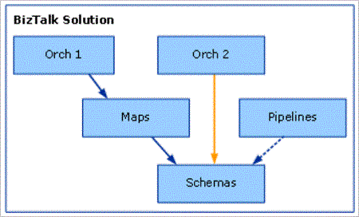
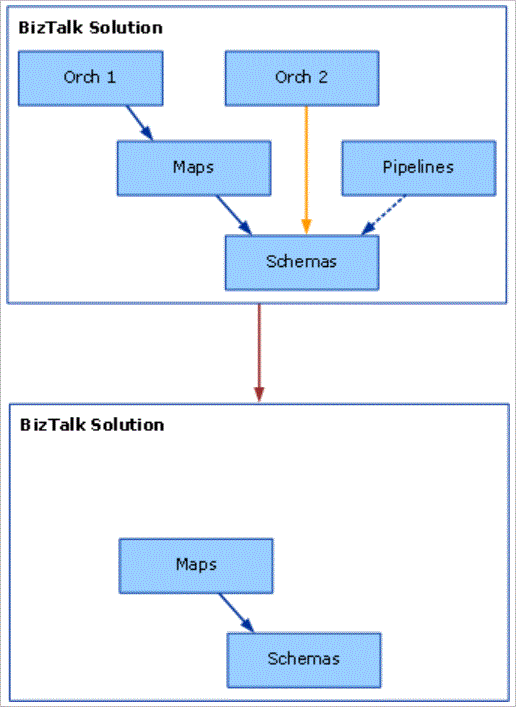

# Troubleshoot BizTalk Server Setup

## Introduction
 This Troubleshooting Guide lists  known issues as well as the most common problems you may encounter while installing BizTalk Server. This guide also includes Custom actions which provides details about BizTalk Server certification for the Windows Server logo program.  It provides you a list of custom actions that might be performed during BizTalk Server Setup operation.

## Review install steps
The majority of BizTalk Server setup problems occur because the BizTalk Server computer was not properly prepared before BizTalk Server was installed, or a previous installation of BizTalk Server was not fully uninstalled before a new installation was attempted.

Review the two checklists below, which you can also find in the BizTalk Server Installation Guides, to ensure that your computer(s) are properly configured to support BizTalk Server. If, after reviewing this information, your setup still does not succeed, the troubleshooting tips in the rest of this document may be useful.

1. Install prerequisite software and programs:

    * [BizTalk Server 2016](set-up-and-install-prerequisites-for-biztalk-server-2016.md)
    * [BizTalk Server 2013 R2 & 2013](prepare-your-computer-for-installation.md)

2. Install and configure BizTalk Server:

    1. Install BizTalk Server: [BizTalk 2016](install-biztalk-server-2016.md) , [BizTalk 2013 R2 / 2013](install-biztalk-server-2013-and-2013-r2.md)
    2. [Configure](configure-biztalk-server.md) BizTalk Server
    3. [Post-configuration steps](post-configuration-steps-to-optimize-your-environment.md)

## Some EDI/AS2 artifacts are still active after unconfiguring

**Problem**
 After you unconfigure the BizTalk EDI/AS2 feature of BizTalk Server, some BizTalk Server artifacts related to EDI and AS2 processing will still be active in the context of the BizTalk group configuration. These artifacts will include EDI and AS2 pipelines and the batching orchestration. As a result, you will still be able to perform basic EDI and AS2 processing even after unconfiguring the BizTalk EDI/AS2 feature.

**Cause**
 There are active ports associated with EDI and AS2 processing. Some artifacts will continue to function while these ports remain active.

**Resolution**
 To disable all EDI/AS2 artifacts, you should disable, stop, or delete the ports associated with EDI and AS2 processing.

## After renaming BizTalk or SQL Server computer, the Configuration Wizard fails

**Problem**
 This problem may manifest itself in several ways:

-   The configuration manager will load the Overview page correctly, but when attempting to configure a feature, the feature options do not display on the screen.

-   The configuration wizard cannot connect to the SQL Server.

-   Attempting to Unconfigure All unconfigures some features, but not all.

**Cause**
 The BizTalk Server configuration stores the computer network name. When the computer is renamed, the configuration manager and configuration wizard cannot locate the BizTalk Server. A similar problem will occur if the SQL Server computer is renamed after BizTalk Server is configured.

**Resolution**
 Do not rename the BizTalk Server computer or the SQL Server computer. If a server must be renamed, unconfigure all BizTalk features before renaming the computer. After renaming the computer, reconfigure BizTalk Server features.

## Business Rules Configuration Wizard fails

**Problem**

-   The Business Rules Configuration Wizard fails with the error “Configuration failed for some components and no settings were applied for those components.”

-   On BizTalk Server computers for which the Business Rules Engine has already been successfully configured, the Rules Engine Update service fails to start and cannot be started manually.

When this problem occurs, an error similar to the following may be generated in the BizTalk Server computer Application log:

```
Service could not be started. : System.Net.Sockets.SocketException (10061): No connection could be made because the target machine actively refused it ::1:3132

```

**Cause**
 The Microsoft Malware Protection Center released an updated signature file on March 9th, 2010 to address a possible threat from SettingsModifier:Win32/PossibleHostsFileHijack. This updated signature file can cause Microsoft Malware Detection software such as Windows Defender to update the local HOSTS file to mitigate threats from SettingsModifier:Win32/PossibleHostsFileHijack. As a result of these changes, the BizTalk Server Rules Engine Update service may fail to start.

**Resolution**
 Update the local HOSTS file to include the following line:

```
127.0.0.1         localhost
```

 The HOSTS file is located in the %systemroot%\drivers\etc\ directory.

> [!NOTE]
> See the Microsoft Malware Protection Center signature update that addresses a possible threat from [SettingsModifier:Win32/PossibleHostsFileHijack](https://go.microsoft.com/fwlink/?LinkId=146221).

## Configuration Logging
 The configuration program writes detailed information to a configuration log file which by default is located in the temp directory of the computer running BizTalk Server. To determine the folder that is specified by the TEMP environment variable open a command prompt on this computer, type the following command, and then press ENTER:

 **echo %TEMP%**

 The configuration log file contains a summary of the configuration steps performed, as well as diagnostic information about any failures that may occur during the configuration process. If a configuration error occurs, open the configuration log in a text editor such as Notepad and check the log file for possible causes of the error.

## Troubleshooting Tools
 Use SQL Server Profiler, Filemon, or Regmon to gather additional information about configuration failures. See [Tools and Utilities to use for Troubleshooting](../core/tools-and-utilities-to-use-for-troubleshooting.md).

### Configuration fails when BizTalk and SQL are installed on separate computers

**Problem**
 Configuration fails with errors similar to the following when attempting to configure the Enterprise Single Sign-On (SSO) component:

```
An error occurred while attempting to access the SSO database.
Function: FieldInfoCreate
```

 -or-

```Failed to enable the Single Sign-On (SSO) Service (error code 0X800706BA)```

**Cause**
 If BizTalk Server and SQL Server are installed on different computers, then the configuration operations are performed under the context of a Microsoft Distributed Transaction Coordinator (MSDTC) transaction and MSDTC functionality must be available over the network between these computers. If MSDTC functionality is not available over the network between the computers running BizTalk Server and SQL Server, then this error can occur.

**Resolution**
Use [Troubleshooting Problems with MSDTC](https://support.microsoft.com/help/306843/how-to-troubleshoot-ms-dtc-firewall-issues) to ensure MSDTC functionality over the network between the computers running BizTalk Server and SQL Server.

### Antivirus software interferes with configuration and causes configuration failures

**Problem**
 BizTalk Server configuration fails when antivirus software incorrectly determines that the configuration program is a virus.

**Cause**
 The antivirus software has not been updated to include the BizTalk Server configuration program as a legitimate (non-virus) program.

**Resolution**
 Configure the antivirus program to recognize the BizTalk Server configuration program as a legitimate (non-virus) program or else temporarily disable the antivirus software while the configuration program is running.

### Configuration fails with a "File or assembly name FileName.dll, or one of its dependencies, was not found" error

**Problem**
 An error similar to the following is displayed during the configuration process:

 Failed to deploy BizTalk system assembly "C:\Program Files\Microsoft\BizTalk Server 20xx\Microsoft.BizTalk.DefaultPipelines.dll. Unspecified exception: File or assembly name FileName .dll, or one of its dependencies, was not found."

**Cause**
 This error can occur if the Network Service account does not have write permissions to the temp folder on the computer running BizTalk Server. During configuration, BizTalk Server configuration uses Windows Management Instrumentation (WMI) to deploy .NET assemblies to the BizTalk Management database. WMI impersonates the Network Service account while deploying these assemblies to the BizTalk Management database and so the Network Service account must have write access to the temp folder on the computer running BizTalk Server.

**Resolution**
 Grant the Network Service account write access to the temp folder on the computer running BizTalk Server and run the configuration program again. To determine the folder that is specified by the TEMP environment variable, open a command prompt on the computer, type the following command, and then press ENTER:

```
echo %TEMP%
```

### Configuration fails if a SQL Server database file that has the same name as the specified database already exists in the SQL Server data folder

#### Problem
 Configuration fails with an error similar to the following:

```
Failed to set up BAM database(s)

Cannot open database requested in login 'BAMPrimaryImport'

Logon fails. Logon failed for user '*BizTalk\BizTalkUser*'
```

**Cause**
 This error can occur if an .mdf file or an .ldf file already exists in the \MSSQL\data folder of the computer running SQL Server that has the same name as the .mdf file or the .ldf file that the BizTalk Server configuration program is trying to create. The names of the .mdf file and the .ldf file that are created for the databases are derived from the name of the database that is specified in the BizTalk Server configuration program with an .mdf and an .ldf extension appended.

**Resolution**
 To resolve this behavior, use one of the following methods:

-   Delete any .mdf files or .ldf files that have names that match the names of any databases that you are creating.

-   Choose database names that do not match the names of any .mdf files or .ldf files that already exist in the \Program Files\Microsoft SQL Server\MSSQL\data folder of your SQL server.

### Configuration fails on a domain controller when specifying local accounts

**Problem**
 When running the BizTalk Server configuration program on a domain controller, configuration fails if you specified a local group (for example, BizTalk Host Users Group) for either the BizTalkServerApplication host or the BizTalkIsolatedHost host.

**Cause**
 A domain controller automatically treats a local Windows group as a domain Windows group (there is no such thing as local Windows group on a domain controller). If you specified a local Windows group for the host while running the configuration program, configuration will fail when trying to create a SQL Server logon for the group. The configuration program does not disable the local Windows group option when the server is a domain controller.

**Resolution**
 Specify domain groups for the hosts that are created during configuration.

### Configuration fails to create SQL Server Analysis database if the SQL server has been renamed

**Problem**
 If you have renamed the computer on which you installed SQL Server Analysis Server, the configuration program fails when it tries to create the new SQL Server Analysis database and an error similar to the following is generated:

```
 Cannot connect to the repository.

 Analysis server: <machine name\>

 Error:

 '\\\\<machine name\>\MsOLAPRepository$\msmdrep.mdb' is not a valid path.

 Make sure that you correctly spell the path name and that you are

 connected to the server on which the file resides.
```

**Cause**
 The configuration program is unable to determine the new name of the computer on which you installed SQL Server Analysis Server.

**Resolution**
 Perform the following manual steps to update Analysis Server with the new computer name:

1.  On the SQL Server, open **Microsoft SQL Server**, select **Analysis Services**, and then click **Analysis Manager**.

2.  In the **Analysis Manager** navigation panel, double-click the **Analysis Servers** node to expand it.

3.  Right-click the server with the repository connection string you want to edit, and then select **Edit Repository Connection String**.

4.  In the **Edit Repository Connection String** dialog box, verify the server name in this string and update it to the new computer name if it is incorrect.

5.  Navigate to the following location: <*installation directory*>\Program Files\Microsoft Analysis Services\Bin.

6.  Right-click the **Bin** folder, and then click **Sharing and Security**. The **Bin Properties** dialog box appears.

7.  In the **Bin Properties** dialog box, click the **Sharing** tab to verify that all Online Analytical Processing (OLAP) administrators have full permissions to this folder.

### Artifacts disappear from Configuration Database on redeployment of assemblies from Visual Studio

**Problem**
 When a BizTalk Server project is redeployed at the project level within Visual Studio, all artifacts contained within the project that reference the project being redeployed will appear to vanish when the BizTalk Server MMC is refreshed.

**Cause**
 To illustrate the cause of this problem, consider the following example based on a sample BizTalk Server solution where a user wants to redeploy the Maps project. Note that compiling projects yields individual assemblies. The following figure indicates the state of the solution before the user does a redeployment. The relationships among the artifacts are as follows:

-   Orch1, Orch2, Maps, Pipelines, and Schemas are projects.

-   Orch1 references Maps, which in turn references Schemas.

-   Orch2 references Schemas.

-   Pipelines references Schemas.



If the user redeploys the Maps project using the default Visual Studio project settings, the Orch1, Orch2, and Pipeline artifacts vanish, as shown in the following figure.



 Redeploying Maps is a two-step process of undeploying the currently deployed Maps.dll assembly, and then deploying the new Maps.dll file. Visual Studio performs these steps automatically as part of the redeployment process.

> [!NOTE]
>  The preceding sentence is not strictly correct because these are steps that Visual Studio always does so there is no notion of it being the proper way.

 The key point is that in order to undeploy a BizTalk Server assembly, Visual Studio has to undeploy all assemblies that are dependent upon that assembly that have the deploy flag set. In our example, to perform the first undeployment step of the redeployment, BizTalk Server needs to undeploy Orch1.dll (which depends on Maps.dll). During the undeployment of Maps.dll, Visual Studio also undeploys Schemas.dll (assuming it has the deploy flag set). In order to undeploy Schemas.dll, Visual Studio needs to undeploy Orch2.dll and Pipelines.dll (both of which depend on Schemas.dll).

 A problem exists in that Visual Studio redeploys only Maps.dll and the assemblies that it depends upon: in this case, Schemas.dll. So when the user refreshes the BizTalk Server MMC, the Orch1, Orch2, and Pipeline assemblies seem to have vanished, but Maps.dll and Schemas.dll are still visible.

**Resolution**
 For the main project (that references other projects) do the following:

1.  In Solution Explorer, right-click the solution node.

2.  Click **Properties** to open the **Solution Property Pages** dialog box.

3.  Click **Configuration Properties**, and then click **Configuration**.

4.  Clear the **Deploy** check box for the referenced project.

5.  In Solution Explorer, execute a new solution-level deployment. To do this, right-click the solution node and then click **Deploy Solution**.

### Supported Virtual Directory Types
 When referencing Web services from an orchestration and attempting to do an MSI export, the export operation will succeed only if the associated virtual directories are of type **IIsWebVirtualDir** or **IIsWebDirectory**. **IIsWebVirtualDir** and **IIsWebDirectory** are the node types that appear in the IIS metabase. **IIsWebVirtualDir** is a virtual directory with a **Path** property that points to an absolute file folder. **IIsWebDirectory** is a virtual directory without a **Path** property and thus refers to a relative file folder, typically a subfolder of another **IIsWebVirtualDir** or **IIsWebDirectory** node. These two types are the ones typically seen in the metabase hierarchy to describe folders.

 Virtual directories of type **IIsConfigObject** are not supported and the MSI export will fail in this case. **IIsConfigObject** is an unexpected metabase node type that is either a valid node type that BizTalk Server is not handling properly or an indication of an improperly created (and thus invalid) metabase entry. In this situation BizTalk Server will display an error message something like the following: Unexpected directory entry " IIS://LM/W3SVC/1/ROOT/BadVdir/" of type IIsConfigObject.

### Unable to view Group information after removing stale logons

**Problem**
 If, during configuration, you encounter and delete stale logons, you may not be able to view Group information.

**Cause**
 This is a known configuration issue.

**Resolution**
 It may help to delete the Host Windows group logons and then reconfigure. If the Group information is still not available, contact Microsoft Product Support.

### Cannot change computer name after BizTalk Server is installed

**Problem**
 When you change the computer name on a computer running BizTalk Server, and you restart (reboot) the computer, error messages may occur.

**Cause**
 SQL Server does not support changing the computer name, so BizTalk Server does not support changing the computer name once BizTalk Server is installed and configured.

**Resolution**
 We recommend that you do not change computer names after you install BizTalk Server.

### Known Issues with Enterprise Single Sign-On
 This section describes setup and configuration problems that may be related to Enterprise Single Sign-On (SSO).

##### ENTSSO Service fails to start

**Problem**
 The ENTSSO service fails to start.

**Cause**
 If the ENTSSO service is not running under a valid SSO Administrator account, it will fail to start.

**Resolution**
 Specify a valid SSO administrator account for the ENTSSO Service and restart the service from Services Control Manager (SCM) snap-in.

##### BizTalk Services dependent on the Enterprise Single Sign-On Service (ENTSSO) fail to start after a reboot

**Problem**
 BTSSvc$BizTalkServerApplication has a dependency on the Enterprise Single Sign-On Service (ENTSSO) and may timeout during start up after a reboot.

**Cause**
 The Enterprise Single Sign-On Service may take around 3 minutes to start.

**Resolution**
 Configure the “BizTalk Service BizTalk Group: BizTalkServerApplication” service with the Automatic (Delayed Start) startup type option. This will initiate the start of the service after all Automatic services have completed their startup routines.

##### Cannot access an affiliate application

**Problem**
 The Enterprise Single Sign-On service disables an affiliate application if the application administrator account associated with it is not valid.

**Cause**
 The SSO application administrator account is not valid.

**Resolution**
 Ensure that the SSO application administrator account is valid before you create an affiliate application. You must then enable the affiliate application to use the application.

##### RPC error occurs when connecting to a client computer

**Problem**
 When you run a command such as **ssomanage -displayapp** *<applicationname\>*, where the computer attempt to connect to a remote SSO Server to retrieve the information, you receive the following error: ERROR: 0x800706BA: The RPC server is unavailable.

**Cause**
 This error occurs when you specify the wrong server information, or when the SSO Service is not available on the remote server.

**Resolution**

-   Follow the steps in [Set the SSO Server](../core/how-to-set-the-sso-server.md) to make sure you are connected to the correct SSO Server.

-   Make sure the SSO Service is enabled and running in the SSO Server to which you are connecting.

##### Master Secret is missing or corrupt

**Problem**
 The master secret is missing or corrupt. It normally generates during configuration. If the secret is missing, one of the following messages will display in the event log as the Enterprise Single Sign-On service starts.

```
MessageId=10520
Severity=Warning
SSO_WARN_NO_SECRETS
MessageId=10565
Severity=Error
SSO_ERROR_SECRET_VALIDATE_FAILED
MessageId=10521
Severity=Error
SSO_ERROR_SECRETS_NOT_LOADED
```

**Cause**
 This problem can occur if a secret is generated while the Enterprise Single Sign-On service (SSO) was running under one service account, and then the service account was changed. The secret is stored in the registry in encrypted form, and is encrypted using a key based on the identity of the service account (which ENTSSO runs under).

**Resolution**
 Change the service account ENTSSO is running under to the original service account when the master secret was created.

1.  Back up the master secret. See [Back Up the Master Secret](../core/how-to-back-up-the-master-secret.md).

2.  Stop Enterprise Single Sign-On Services.

3.  Change the service account.

4.  Restart SSO and ignore any event log errors about a corrupted secret.

5.  Restore the master secret. See [Restore the Master Secret](../core/how-to-restore-the-master-secret.md).

### Custom Action
 This topic provides details about BizTalk Server certification for the Windows Server logo program. The following custom actions might be performed during BizTalk Server Setup operations.

|Custom action|Description|
|-------------------|-----------------|
|ReadComplusData|Reads custom COM+ tables, creates XML document, and saves it in the Complus_XML_Data property.|
|SchedXmlConfig|Used for configuring machines having RFID data.|
|CheckBaseEDI|Checks the presence of an old version of EDI|
|CheckMQSeries|Checks the presence of MQSeries|
|CheckNET30Vista|Checks the presence of WCF|
|CheckWSSV3SP1|Checks the presence of Windows SharePoint Services 3.0 SP1.|
|CheckWSSV4|Checks the presence of Windows SharePoint Services 4|
|GetFrameworkPath|Sets installer properties in the installer that holds installation path to Microsoft .Net framework 4 and 2.0.|
|Set_BAMClientExcelDir|Creates an Excel application object for setting a property to hold the Microsoft Office library path in the installer.|
|Set_CurrentUser|Sets domain\username information of the current user|
|ViewInstallGuide|Launches the BizTalk Server installation guide from the installation source directory.|
|CA_CheckSTSLanguage|Sets STS_Language_Property property when the language set for WSS and BizTalk are same.|
|CA_CleanupRegistry|When you uninstall BizTalk Server, it cleans the registry entries that were created during BizTalk Server configuration.|
|CA_CleanupRegistry_OldProducts|Cleans the registry entries that belong to an older version of BizTalk Server and are not required for a fresh installation of BizTalk Server.|
|CA_RemovePatches|Removes Microsoft BizTalk Server updates when you uninstall BizTalk Server.|
|CA_ResolveWellKnownNames|Creates installer properties with well-known names and assigns them their corresponding SID.|
|CA_SaveTargetVSVersionToRegistry|Sets a TargetVSVersion_Property property to the value of a supported version of Visual Studio.|
|CA_StopServices|Stops IISAdmin, Rules Engine Update and EDI Subsystem services.|
|CleanupUsersKeys|Removes BizTalk Server related entries from the HKEY_CURRENT_USER registry key.|
|DevEnvRunning|Checks whether Visual Studio is running|
|ValidateINSTALLDIR|Validates BizTalk Server installation directory format|
|StartHostInstances|Starts BizTalk Server Host Instances.|
|StopHostInstances|Stops BizTalk Server Host Instances.|
|MQSUnConfig|Launches MQSeries Configuration wizard for un-configuring MQSeries agent.|
|LaunchConfigFmk|Launches BizTalk Server Configuration Wizard|
|CHKASPNET|Checks the install state of ASP.NET|
|CHKIIS|Checks the install state of IIS|
|TBExpired|Checks if the BizTalk Server TimeBomb has expired|
|BrandSKU|Updates the value of BizTalk Server timebomb which depends on SKU installation.|
|CA_ERROR|Returns installation failure|
|InstallComplus|Installs Complus applications and components.|
|BAM_Add_Perf_Silent|Installs performance counters for BAM|
|RegsvcsApplicationDeployment|Runs Regsvcs.exe (.NET Services Installation Tool) on BizTalk Deployment COM+ application DLLs|
|RegsvcsDeployment|Runs Regsvcs.exe on DLLs|
|RegsvcsMQSAdapter|Runs Regsvcs.exe on DLLs|
|RegsvcsSQLAdapter|Runs Regsvcs.exe on DLLs|
|WMI_Add_MSBTS_Silent|Registers BizTalk Server namespace and classes to WMI.|
|LaunchConfigFmk_SlashUP|Un-configures BizTalk Server|
|CleanupComplus|Uninstalls Complus Applications and components.|
|RemoveSKU|Removes BizTalk Server TimeBomb data.|
|BAM_Remove_Perf|Uninstalls performance counters for BAM.|
|LoadBTSCounters|Loads BizTalk Server performance counters.|
|RegisterBtprojExtn|Registers BizTalk project file (.btproj) extension.|
|UnRegisterBtprojExtn|Un-registers BizTalk project file (.btproj) extension.|
|UnRegsvcsApplicationDeployment|Runs Regsvcs.exe on certain DLLs when you uninstall BizTalk Server|
|UnRegsvcsDeployment|Runs Regsvcs.exe on certain DLLs when you uninstall BizTalk Server|
|UnRegsvcsMQSAdapter|Runs Regsvcs.exe on certain DLLs when you uninstall BizTalk Server|
|UnRegsvcsSQLAdapter|Runs Regsvcs.exe on certain DLLs when you uninstall BizTalk Server|
|UnloadBTSCounters|Unloads BizTalk Server performance counters.|
|WMI_Remove_MSBTS|Removes BizTalk Server namespace from WMI.|
|RegisterComsvcs|Runs regsvr32.exe on comsvcs.dll silently.|
|DevenvSetupUninstall|Runs DevEnv.exe /Setup/resetskippkgs.|
|RollbackComplus|Rollbacks the installation of Complus applications and components.|
|ResRegsvcsMQSAdapter|Runs regsvcs.exe on a given binary|
|ResRegsvcsSQLAdapter|Runs regsvcs.exe on a given binary|
|RestoreRegsvcsApplicationDeployment|Appends the path of framework with Microsoft.BizTalk.ApplicationDeployment.Engine.dll.|
|RestoreRegsvcsDeployment|Appends the path of framework with Microsoft.BizTalk.ApplicationDeployment.Engine.dll.|
|BrandSKURollback|Rollbacks registered SKU information if installation failure occurs.|
|CA_RestartServices_rollback|Restarts the stopped services.|
|RemoveSKURollback|Updates the SKU values from the registry.|
|BAM_Res_Perf_Silent|Registers Microsoft.BizTalk.Bam.EventObservation.dll as the BAM performance counter DLLs during silent installation.|
|BAM_Rollback_Perf|Unregisters  Microsoft.BizTalk.Bam.EventObservation.dll as the BAM performance counter DLL|
|RBKRegsvcsMQSAdapter|Runs regsvcs.exe on a given binary.|
|RBKRegsvcsSQLAdapter|Runs regsvcs.exe on a given binary.|
|RestoreBTSCounters|Restores the property with the performance counter .ini file name.|
|RollbackBTSCounters|Runs command unlodctr BTSSvc.3.0.|
|RollbackRegsvcsApplicationDeployment|Sets up [FrameworkPath]&#124;[INSTALLDIR]Microsoft.BizTalk.ApplicationDeployment.Engine.dll for the failed installation scenarios.|
|RollbackRegsvcsDeployment|Invokes regsvcs.exe during uninstall/rollback scenarios.|
|WMI_Restore_MSBTS_Silent|Calls mofcomp to register WMI schemas|
|WMI_Rollback_MSBTS|Removes BizTalk Server namespace from WMI.|
|CA_RestartServices_commit|Restarts the stopped services|
|DevenvSetup|Runs DevEnv.exe /Setup /resetskippkgs both during BizTalk Server install/uninstall process.|
|ExecXmlConfig|Used to make configuration changes to machine.config for RFID related data.|
|ExecXmlConfigRollback|Used to make configuration changes to machine.config for RFID related data.|

#### Running BizTalk Components
 The following table lists BizTalk components that must be run using administrative privileges or with highest available privilege.

|Folder path|File name|User privileges|
|-----------------|---------------|---------------------|
|\Program Files (x86)\Common Files\Microsoft shared\Help 9\Microsoft Document Explorer 2008|Install.exe|Highest available privilege|
|\Program Files (x86)\Microsoft BizTalk Server *your version*|BTSHatApp.exe|Highest available privilege|
|\Program Files (x86)\Microsoft BizTalk Server *your version*|BTSMMCLauncher.exe|Highest available privilege|
|\Program Files (x86)\Microsoft BizTalk Server *your version*|BtsWcfServicePublishingWizard.exe|Highest available privilege|
|\Program Files (x86)\Microsoft BizTalk Server *your version*|BTSWebSvcWiz.exe|Highest available privilege|
|\Program Files (x86)\Microsoft BizTalk Server *your version*|Configuration.exe|Highest available privilege|
|\Program Files (x86)\Microsoft BizTalk Server *your version*|REDeployWiz.exe|Highest available privilege|
|\Program Files (x86)\Microsoft BizTalk Server *your version*|Setup.exe|Administrative privilege|
|\Program Files (x86)\Microsoft BizTalk Server *your version*\XSD Schema\EDI|MicrosoftEdiXSDTemplates.exe|Self-extracting .exe file.|
|\Program Files (x86)\Microsoft UDDI Services\config|Configuration .exe|Administrative privilege|
|\Program Files\ Microsoft BizTalk RFID\bin|BTSMMCLauncher.exe|Highest available privilege|
|\Program Files\Microsoft BizTalk RFID\BREConfi guration|Configuration .exe|Administrative privilege|
