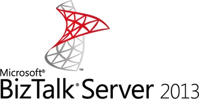

# BizTalk Server 2013 Performance Optimization Guide

## Microsoft BizTalk Server 2013 Performance Optimization Guide
 **Summary**

 The BizTalk Server 2013 Performance Optimization Guide contains prescriptive guidance for optimizing BizTalk Server performance, based upon hands-on experience of IT professionals who have worked extensively with BizTalk Server. This guide contains four main sections: Finding and Eliminating Bottlenecks, Optimizing Performance, Scaling a Production BizTalk Server Environment, and BizTalk Server Performance Testing Methodology.

 The operating system, SQL Server configuration, and other performance settings also apply to BizTalk Server 2013 R2.

 To review the document, please download the [Microsoft BizTalk Server 2013 Performance Optimization Guide](https://download.microsoft.com/download/6/D/E/6DEE8EE9-0F26-4991-8FE5-B0E5239C0980/BizTalkServer2013-PerformanceGuide.docx) Word document.
